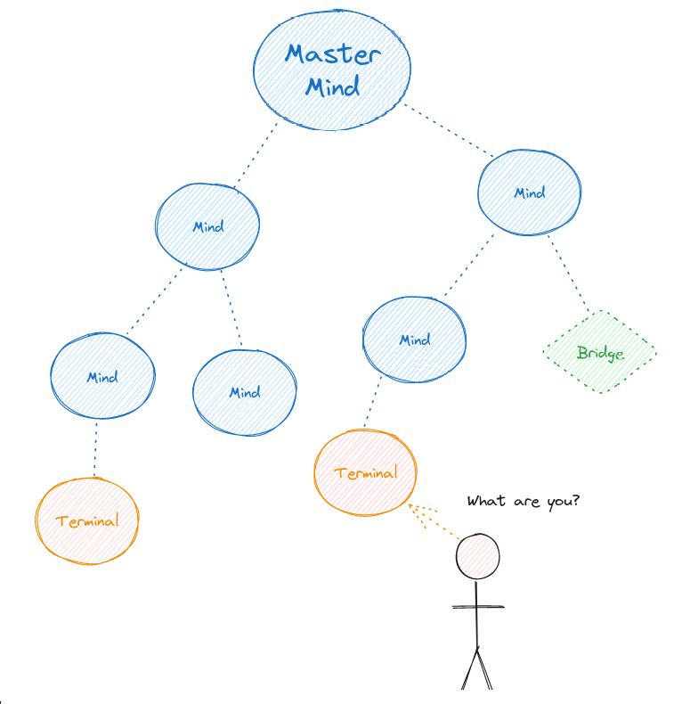

## Terminology

Before we delve into the depths of the Hivemind Protocol, let's familiarize ourselves with some key terms used within the ecosystem:

- **Node**: A device or software client that is part of to the Hivemind network.

- **Mind**: A node that actively listens for connections and understands natural language commands. communicates via [BUS messages](./04_protocol.md), **authenticates** other nodes, **isolates** messages per client, and **authorizes** individual messagwa

- **Fakecroft**: A mind that imitates ovos-core without actually running it. usually only handles a subset of [BUS messages](./04_protocol.md)

- **Terminal**: A user-facing node that connects to a mind but doesn't accept connections itself.

- **Bridge**: A node that links an external service to a mind.

- **Slave**: A mind that connects to another mind and **always accepts** [BUS messages](./04_protocol.md) from it.

- **Hive**: A collection of interconnected nodes forming a collaborative network.

- **Master Mind**: The highest-level node in a hive that is not connected to any other nodes but receives connections from other nodes.

- **Hive Mind**: The collection of all Master Minds in the world

