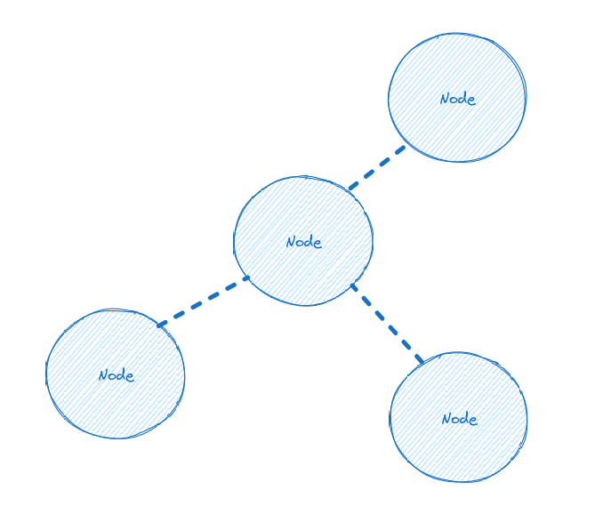
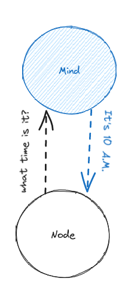
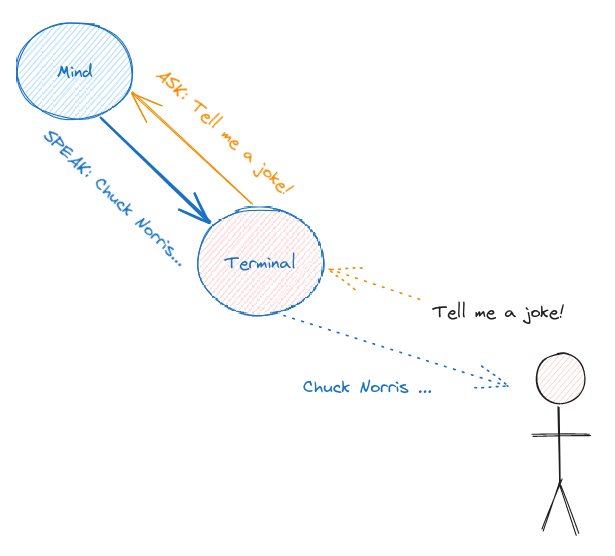
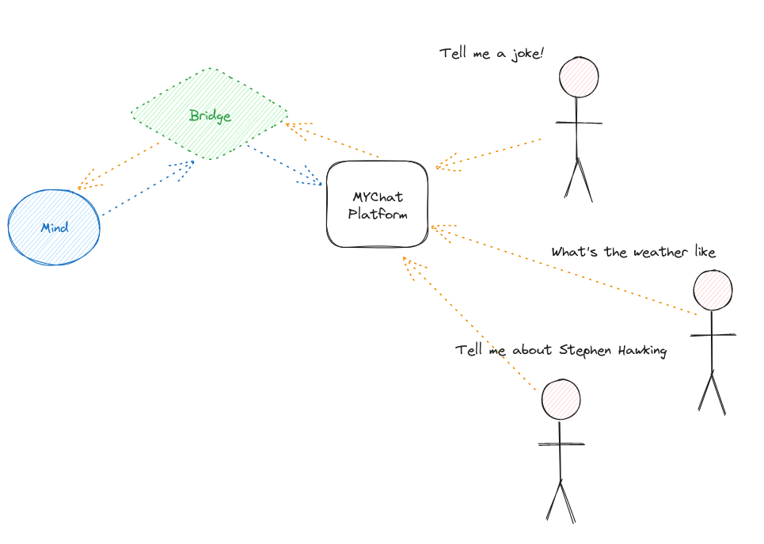
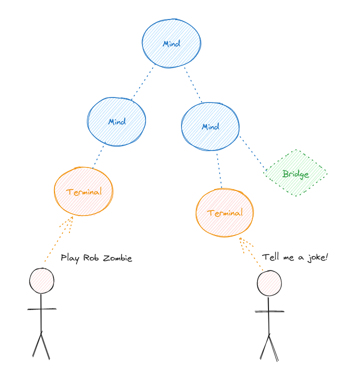
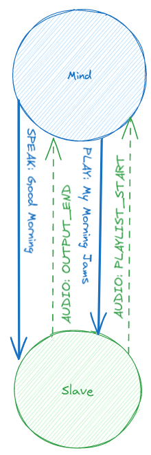
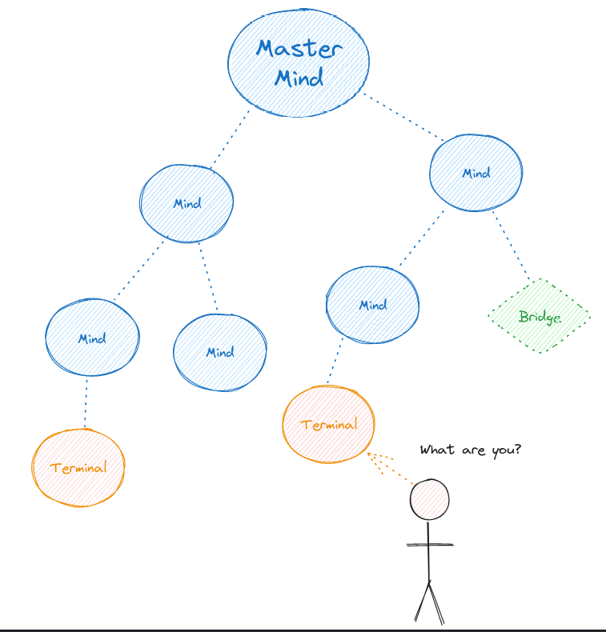
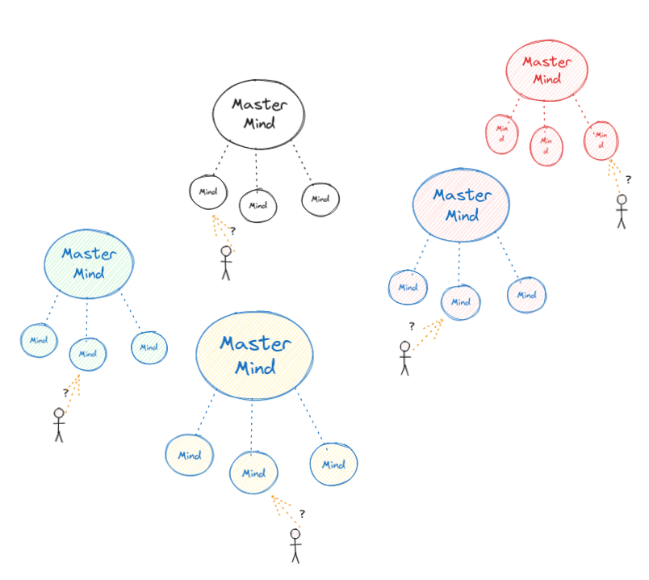

## Terminology

Before you read the HiveMind protocol pages, learn these key terms used across the ecosystem.

- **Node**: A device or software client that is part of the HiveMind network.

- **Mind**: A node that listens for connections and understands natural language commands. Minds communicate over [BUS messages](04_protocol.md), authenticate other nodes, isolate connections, and authorize individual messages.

- **Fakecroft**: A mind that imitates ovos-core without running it. It often handles only a subset of [BUS messages](04_protocol.md), usually just `"speak"` and `"recognizer_loop:utterance"`.

- **Terminal**: A user-facing node that connects to a mind but does not accept connections itself.

- **Bridge**: A node that links an external service to a mind.

- **Hive**: A collection of interconnected nodes that form a collaborative network.

- **Slave**: A mind that connects to another mind and always accepts [BUS messages](04_protocol.md) from it.

A Terminal is like a Slave, but it is not a Mind.

- **Master Mind**: The highest-level node in a hive. It is not connected to any other nodes, but receives connections from other nodes.

- **The Collective**: The collection of all Master Minds in the world.

---
[← Quick start](01_quickstart.md) · [Home](index.md) · [Nested Hives →](15_nested.md)
