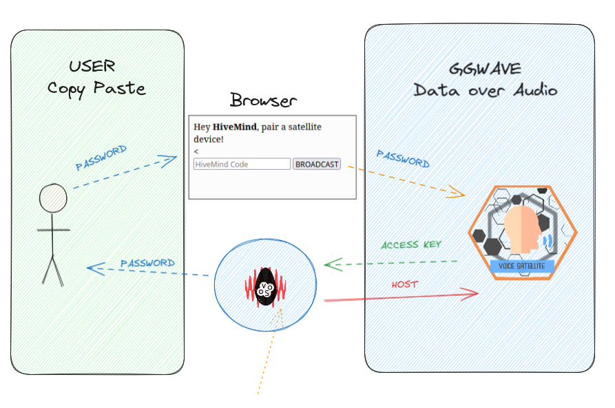

# Pairing devices

You can register clients in a Mind via command line or via audio

## Command Line

hivemind-core provides a command line interface to manage client permissions

```bash
$ hivemind-core --help
Usage: hivemind-core [OPTIONS] COMMAND [ARGS]...

Options:
  --help  Show this message and exit.

Commands:
  add-client     add credentials for a client
  allow-msg      allow message types sent from a client
  delete-client  remove credentials for a client
  list-clients   list clients and credentials
  listen         start listening for HiveMind connections
```

```shell
$ hivemind-core add-client --help
Usage: hivemind-core add-client [OPTIONS] [NAME] [ACCESS_KEY] [PASSWORD]
                                [CRYPTO_KEY]

  add credentials for a client

Options:
  --help  Show this message and exit.
```

```shell
$ hivemind-core delete-client --help
Usage: hivemind-core delete-client [OPTIONS] NODE_ID

  remove credentials for a client

Options:
  --help  Show this message and exit.
```

```shell
$ hivemind-core list-clients --help
Usage: hivemind-core list-clients [OPTIONS]

  list clients and credentials

Options:
  --help  Show this message and exit.

```

```shell
$ hivemind-core allow-msg --help
Usage: hivemind-core allow-msg [OPTIONS] MSG_TYPE [NODE_ID]

  allow message types sent from a client

Options:
  --help  Show this message and exit.
```

## HiveMind GGWave

Data over sound for HiveMind

hivemind-core and hivemind-voice-sat have hivemind-ggwave support

pre-requisites:

- a device with a browser, eg a phone

- a hivemind-core device with mic and speaker, eg a mark2

- a (unpaired) voice satellite device with mic and speaker, eg a raspberry pi

- all devices need to be in audible range, they each need to be able to listen to sounds emitted by each other

workflow:

- when launching hivemind-core take note of the provided code, eg `HMPSWD:ce357a6b59f6b1f9`

- copy paste the code and emit it via ggwave (see below)

- the voice satellite will decode the password, generate an access key and send it back via ggwave

- master adds a client with key + password, send an ack (containing host) via ggwave

- satellite devices get the ack then connect to received host




- manually exchanged string [via browser](https://jarbashivemind.github.io/hivemind-ggwave/)
  
<iframe src="https://jarbashivemind.github.io/hivemind-ggwave"></iframe>

- with a [talking button](https://github.com/ggerganov/ggwave/discussions/27)

<video src="https://user-images.githubusercontent.com/1991296/166411509-5e1b9bcb-3655-40b1-9dc3-9bec72889dcf.mp4" width="320"></video>
