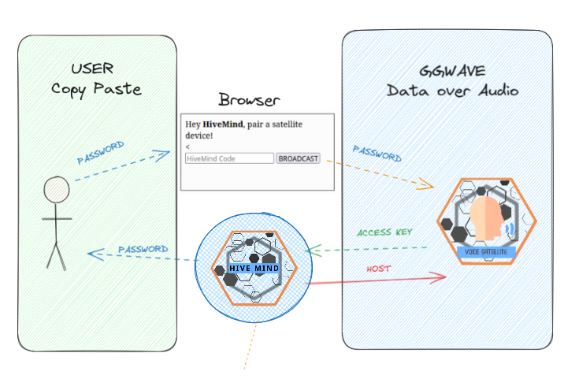

# Pairing Devices

You can register clients in a Mind through the command line or with audio.

## Command line pairing

First, register the satellite device on the HiveMind server:

```bash
hivemind-core add-client
Credentials added to database!

Node ID: 2
Friendly Name: HiveMind-Node-2
Access Key: 5a9e580a2773a262cbb23fe9759881ff
Password: 9b247ca66c7cd2b6388ad49ca504279d
Encryption Key: 4185240103de0770
WARNING: Encryption Key is deprecated, only use if your client does not support password
```

Then set the identity file on the satellite device:
```bash
hivemind-client set-identity --key 5a9e580a2773a262cbb23fe9759881ff --password 9b247ca66c7cd2b6388ad49ca504279d --host 0.0.0.0 --port 5678 --siteid test
identity saved: /home/miro/.config/hivemind/_identity.json
```

Check the created identity file if you like:
```bash
cat ~/.config/hivemind/_identity.json
{
    "password": "9b247ca66c7cd2b6388ad49ca504279d",
    "access_key": "5a9e580a2773a262cbb23fe9759881ff",
    "site_id": "test",
    "default_port": 5678,
    "default_master": "ws://0.0.0.0"
}
```

Test that a connection is possible with the identity file:
```bash
hivemind-client test-identity
(...)
2024-05-20 21:22:28.003 - OVOS - hivemind_bus_client.client:__init__:112 - INFO - Session ID: 34d75c93-4e65-4ea9-b5f4-87169dcfda01
(...)
== Identity successfully connected to HiveMind!
```

If the identity test passes, your satellite is paired with the hive.

## Audio pairing with GGWave

> This feature is a proof of concept and a work in progress.

GGWave sends data over sound for HiveMind.

`hivemind-core` and `hivemind-voice-sat` support `hivemind-ggwave`.

Prerequisites:

- a device with a browser, such as a phone.
- a hivemind-core device with a microphone and speaker, such as a Mark 2.
- an unpaired voice satellite device with a microphone and speaker, such as a Raspberry Pi.
- all devices in audible range of each other, so each can hear the sounds the others emit.

Workflow:

- Launch hivemind-core and note the provided code, for example `HMPSWD:ce357a6b59f6b1f9`.
- Copy the code and emit it with GGWave (see below).
- The voice satellite decodes the password, generates an access key, and sends it back with GGWave.
- The master adds a client with the key and password, and sends an acknowledgment (containing the host) with GGWave.
- The satellite gets the acknowledgment, then connects to the received host.



- Exchange the string manually [through a browser](https://jarbashivemind.github.io/hivemind-ggwave/).

<iframe src="https://jarbashivemind.github.io/hivemind-ggwave"></iframe>

- Or use a [talking button](https://github.com/ggerganov/ggwave/discussions/27).

<video src="https://user-images.githubusercontent.com/1991296/166411509-5e1b9bcb-3655-40b1-9dc3-9bec72889dcf.mp4" width="320"></video>

## The Identity File

The identity file stores the credentials and settings a node needs to connect and communicate within the HiveMind network. It lets the node authenticate and keep secure connections with other nodes.

Connection parameters can be set at launch time, but this file lets you reuse them across the whole OS.

### Contents of the identity file

The identity file is usually at `~/.config/hivemind/_identity.json` and contains:

| Field           | Description                                                                                  |
|-----------------|----------------------------------------------------------------------------------------------|
| `name`          | A human-readable label for the node, not guaranteed to be unique.                            |
| `password`      | The password used to generate a session AES key for secure communication within the HiveMind network. |
| `access_key`    | A unique access key assigned to the node for identification and authentication.              |
| `site_id`       | An identifier for the physical location or context where the node operates.                  |
| `default_port`  | The default port number used to connect to the HiveMind core.                                |
| `default_master`| The default host (address) of the HiveMind core the node connects to.                        |
| `public_key`    | The ASCII-encoded public PGP key used to authenticate the node within the HiveMind network.  |
| `secret_key`    | The path to the private PGP key file, which uniquely identifies the node and proves its identity. |

By keeping these details in the identity file, nodes can join the HiveMind network securely and efficiently.

If a node needs to communicate securely with, or authenticate, another node that is not the master, it can use the public key. See [intercom messages](04_protocol.md#intercom-message) for details.

You can also target groups of devices by their `site_id`. For example, you can [propagate](04_protocol.md#propagate-message) a speak message to announce dinner is ready, or [broadcast](04_protocol.md#broadcast-message) a bus message that orders all devices with a camera in an area to take a picture.

#### Public key

The public key in the identity file is part of a PGP key pair that uniquely identifies the node. It serves several purposes:

1. **Unique node identification**: the PGP key uniquely identifies this node within the HiveMind network.
2. **Inter-node authentication**: nodes use the PGP key to authenticate each other, so only authorized nodes can communicate within the network.
3. **Network independence**: the PGP key lets nodes identify each other regardless of the specific HiveMind core (mind) they connect to. Even if a node switches minds, it still recognizes and authenticates other nodes by their PGP keys.

#### Private key

The private key is the only way for a node to read a message encrypted with its matching public key. Keep this file safe and private at all times.

By default, HiveMind stores the private key at `~/.config/hivemind/HiveMindComs.asc`.

If you believe your private key was compromised, or you simply want new keys, use the `hivemind-client reset-pgp` command.

---
[← Binarization](18_binarization.md) · [Home](index.md) · [Permissions →](16_permissions.md)
