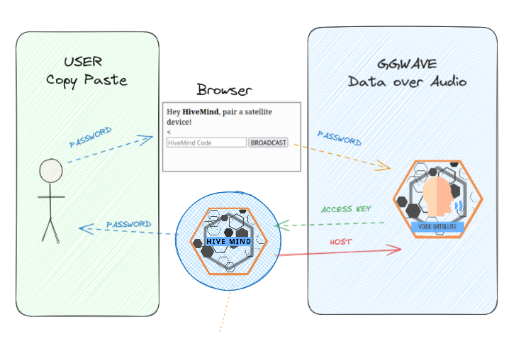

# Pairing devices

You can register clients in a Mind via command line or via audio

## Command Line Pairing

First, you need to register the satellite devices in the HiveMind **server**

```bash
$ hivemind-core add-client
Credentials added to database!

Node ID: 2
Friendly Name: HiveMind-Node-2
Access Key: 5a9e580a2773a262cbb23fe9759881ff
Password: 9b247ca66c7cd2b6388ad49ca504279d
Encryption Key: 4185240103de0770
WARNING: Encryption Key is deprecated, only use if your client does not support password
```

And then set the identity file in the **satellite** device
```bash
$ hivemind-client set-identity --key 5a9e580a2773a262cbb23fe9759881ff --password 9b247ca66c7cd2b6388ad49ca504279d --host 0.0.0.0 --port 5678 --siteid test
identity saved: /home/miro/.config/hivemind/_identity.json
```

check the created identity file if you like
```bash
$ cat ~/.config/hivemind/_identity.json
{
    "password": "9b247ca66c7cd2b6388ad49ca504279d",
    "access_key": "5a9e580a2773a262cbb23fe9759881ff",
    "site_id": "test",
    "default_port": 5678,
    "default_master": "ws://0.0.0.0"
}
```

test that a connection is possible using the identity file
```bash
$ hivemind-client test-identity
(...)
2024-05-20 21:22:28.003 - OVOS - hivemind_bus_client.client:__init__:112 - INFO - Session ID: 34d75c93-4e65-4ea9-b5f4-87169dcfda01
(...)
== Identity successfully connected to HiveMind!
```

If the identity test passed, then your satellite is paired with the Hive!

## Audio Pairing via GGWave

> 🚧 This feature is a proof-of-concept / work-in-progress

Data over sound for HiveMind

`hivemind-core` and `hivemind-voice-sat` have `hivemind-ggwave` support

pre-requisites:

- a device with a browser, eg a phone

- a hivemind-core device with mic and speaker, eg a mark2

- a (unpaired) voice satellite device with mic and speaker, eg a raspberry pi

- all devices need to be in audible range, they each need to be able to listen to sounds emitted by each other

workflow:

- when launching hivemind-core take note of the provided code, eg `HMPSWD:ce357a6b59f6b1f9`

- copy paste the code and emit it via ggwave (see below)

- the voice satellite will decode the password, generate an access key and send it back via ggwave

- master adds a client with key + password, send an ack (containing host) via ggwave

- satellite devices get the ack then connect to received host



- manually exchanged string [via browser](https://jarbashivemind.github.io/hivemind-ggwave/)
  
<iframe src="https://jarbashivemind.github.io/hivemind-ggwave"></iframe>

- with a [talking button](https://github.com/ggerganov/ggwave/discussions/27)

<video src="https://user-images.githubusercontent.com/1991296/166411509-5e1b9bcb-3655-40b1-9dc3-9bec72889dcf.mp4" width="320"></video>


## The Identity File

The identity file is a crucial component in the HiveMind ecosystem, as it stores the necessary credentials and settings for a node (device) to connect and communicate within the HiveMind network. This file ensures that the node can authenticate and maintain secure connections with other nodes.

While connection parameters can be set at launch time, this file provides a way to reuse them across the whole OS

### Contents of the identity file

The identity file, typically located at `~/.config/hivemind/_identity.json`, contains the following information:

| Field           | Description                                                                                  |
|-----------------|----------------------------------------------------------------------------------------------|
| `name`          | A human-readable label for the node, which is not guaranteed to be unique.                   |
| `password`      | The password used to generate a session AES key for secure communication within the HiveMind network. |
| `access_key`    | A unique access key assigned to the node for identification and authentication.              |
| `site_id`       | An identifier for the physical location or context in which the node is operating.           |
| `default_port`  | The default port number used to connect to the HiveMind core.                                |
| `default_master`| The default host (address) of the HiveMind core that the node connects to.                   |
| `public_key`    | The ASCII-encoded public PGP key used for authenticating the node within the HiveMind network.|
| `secret_key`    | The path to the private PGP key file, which uniquely identifies the node and proves its identity. |

By maintaining these details in the identity file, nodes can securely and efficiently participate in the HiveMind network, facilitating a seamless and secure distributed communication environment.

If a node needs to securely communicate or authenticate another (that isn't the master) it can do so via the public key. See the section for [intercom messages](https://jarbashivemind.github.io/HiveMind-community-docs/12_hive/#intercom) for more details

Groups of devices can also be targeted via their `site_id`, for example, we can [propagate](https://jarbashivemind.github.io/HiveMind-community-docs/04_protocol/#propagate-message) a speak message to announce dinner is ready or [broadcast](https://jarbashivemind.github.io/HiveMind-community-docs/04_protocol/#broadcast-message) a bus message to order all devices in a certain area equipped with a camera to take a picture. 

#### Public Key

The Public Key in the identity file is part of a PGP key pair used to uniquely identify the node. This key serves several purposes:

1. **Unique Node Identification:** The PGP key uniquely identifies this node within the HiveMind network, ensuring that each node can be distinctly recognized.
   
2. **Inter-Node Authentication:** Nodes can use the PGP key to authenticate each other, providing a layer of security that ensures only authorized nodes can communicate within the network.

3. **Network Independence:** The PGP key allows nodes to identify each other regardless of the specific HiveMind core (mind) they are connected to. This means that even if nodes switch Minds, they can still recognize and authenticate each other using their PGP keys.

#### Private Key

The Private Key is the only way for a node to read a message encrypted with it's corresponding public key. This file must be kept safe and private at all times!

By default, the private key is stored in `~/.config/hivemind/HiveMindComs.asc`

If you believe your private key has been compromised, or simply want to change keys you can use the `hivemind-client reset-pgp` command
