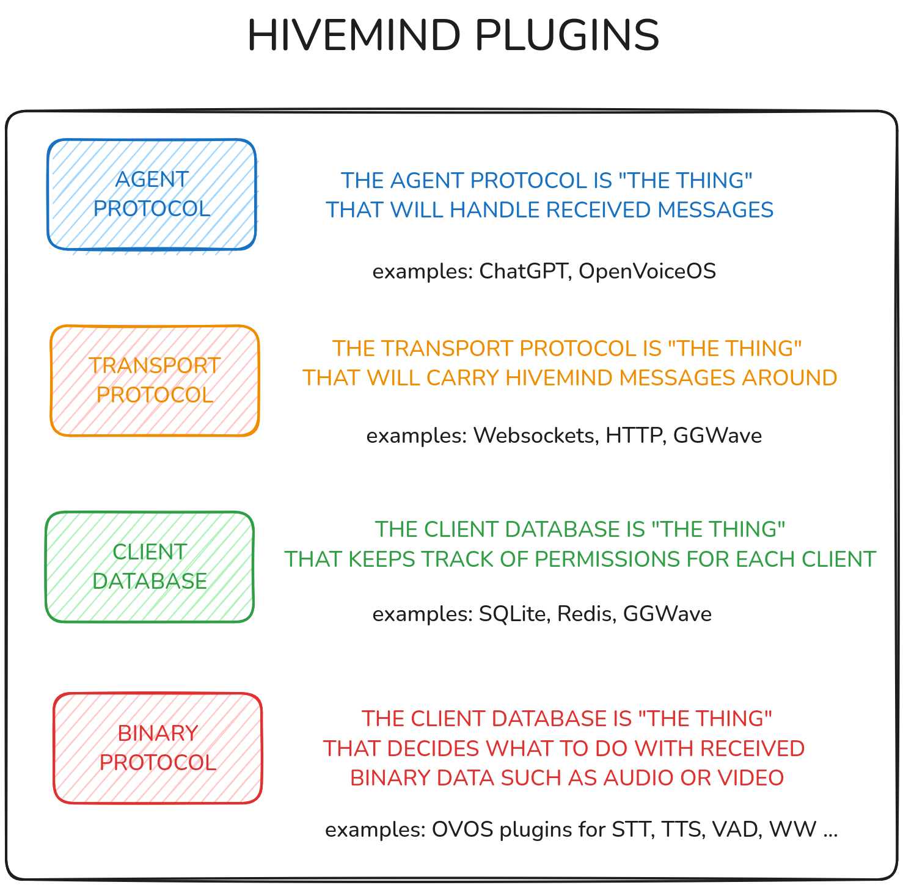

# HiveMind Plugin Manager

The HiveMind Plugin Manager (HPM) discovers, manages, and loads plugins within the HiveMind ecosystem. It supports several plugin types: databases, network protocols, agent protocols, and binary data handlers. HPM loads these plugins dynamically, so HiveMind agents can extend their functionality.

## Features

- **Plugin discovery**: find and load plugins of different types, including:
  - **Database plugins**: support various database types, such as JSON, SQLite, and Redis.
  - **Agent protocol plugins**: integrate agent protocols like OVOS and Persona, so HiveMind agents can communicate with each other.
  - **Network protocol plugins**: enable network protocols such as WebSockets for distributed communication.
  - **Binary data handler plugins**: handle binary data communication, such as audio data over HiveMind.
- **Plugin loading**: load a specific plugin by name, type, or available entry point.
- **Factories for plugin instantiation**: each plugin type (database, agent protocol, network protocol, binary protocol) has a factory that creates instances based on your configuration.

## Plugin types



### 1. Database plugins

Supports several database systems:

- **JSON database**: stores data as JSON files.
- **SQLite database**: uses SQLite for local database storage.
- **Redis database**: uses Redis for distributed caching and storage.

### 2. Agent protocol plugins

Supports communication protocols for agents:

- **OVOS protocol**: for interaction with OVOS-based agents.
- **Persona protocol**: for interaction with the Persona framework.

### 3. Network protocol plugins

Enables network communication protocols:

- **WebSocket protocol**: for real-time, bidirectional communication over WebSockets.

### 4. Binary data handler protocol plugins

Handles communication of binary data types, such as audio, using specialized protocols.

## Developers

This example shows how to discover and load plugins, and how to create instances with the provided factories.

### Installation

`hivemind-plugin-manager` is a dependency of `hivemind-core`. You typically do not need to install it directly.

```bash
pip install hivemind-plugin-manager
```

### Discovering plugins

Use the `find_plugins` function to discover all available plugins for a specific type:

```python
from hivemind_plugin_manager import find_plugins, HiveMindPluginTypes

# Find all database plugins
database_plugins = find_plugins(HiveMindPluginTypes.DATABASE)
print(database_plugins)

# Find all agent protocol plugins
agent_protocol_plugins = find_plugins(HiveMindPluginTypes.AGENT_PROTOCOL)
print(agent_protocol_plugins)
```

### Creating plugin instances

Each plugin type has a factory class that creates plugin instances with the configuration you provide.

#### Database plugin factory

```python
from hivemind_plugin_manager import DatabaseFactory

# Create an instance of a database plugin
db_instance = DatabaseFactory.create("hivemind-redis-db-plugin", password="Password1!", host="192.168.1.11", port=6789)
```

#### Agent protocol factory

```python
from hivemind_plugin_manager import AgentProtocolFactory

# Create an agent protocol instance
agent_protocol_instance = AgentProtocolFactory.create("hivemind-ovos-agent-plugin")
```

#### Network protocol factory

```python
from hivemind_plugin_manager import NetworkProtocolFactory

# Create a network protocol instance
network_protocol_instance = NetworkProtocolFactory.create("hivemind-websocket-plugin")
```

#### Binary data handler protocol factory

```python
from hivemind_plugin_manager import BinaryDataHandlerProtocolFactory

# Create a binary data handler protocol instance
binary_data_handler_instance = BinaryDataHandlerProtocolFactory.create("hivemind-audio-binary-protocol-plugin")
```

---
[← Nested Hives](15_nested.md) · [Home](index.md) · [Configuration →](config.md)
