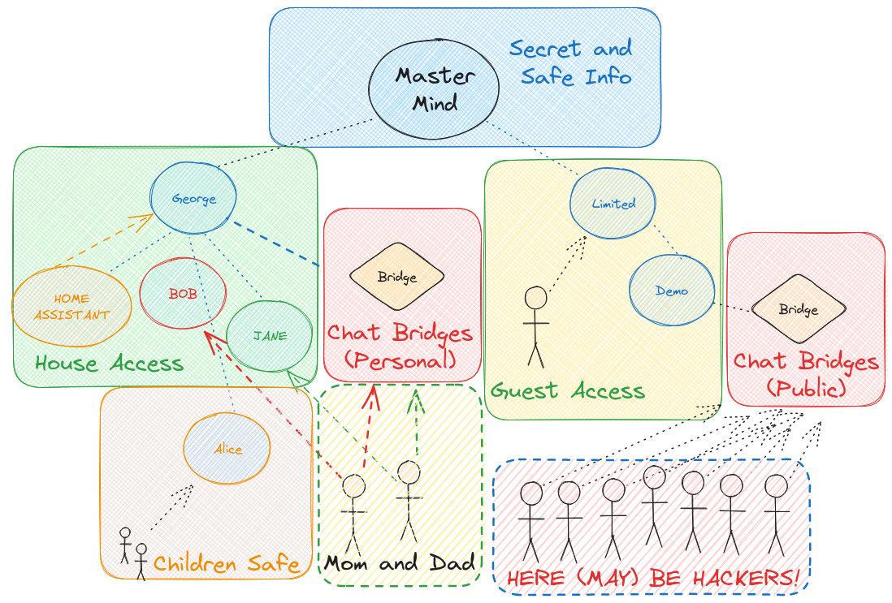

# OpenVoiceOS Skills Server

Hivemind-core is the reference integrations with OpenVoiceOS



> 💡 If you are running on a home server you only need `hivemind-core`, `ovos-core` and `ovos-messagebus`


## Install

```bash
pip install hivemind-core
```

## Usage

Everything is done via the `hivemind-core` command, see [pairing](./03_pairing.md) for more info

```shell
$ hivemind-core --help
Usage: hivemind-core [OPTIONS] COMMAND [ARGS]...

Options:
  --help  Show this message and exit.

Commands:
  add-client     add credentials for a client
  allow-msg      allow message types sent from a client
  delete-client  remove credentials for a client
  list-clients   list clients and credentials
  listen         start listening for HiveMind connections
```

```shell
$ hivemind-core listen --help
Usage: hivemind-core listen [OPTIONS]

  start listening for HiveMind connections

Options:
  --host TEXT       HiveMind host
  --port INTEGER    HiveMind port number
  --ssl BOOLEAN     use wss://
  --cert_dir TEXT   HiveMind SSL certificate directory
  --cert_name TEXT  HiveMind SSL certificate file name
  --db-backend [redis|json|sqlite]
                                  Select the database backend to use. Options:
                                  redis, sqlite, json.
  --db-name TEXT                  [json/sqlite] The name for the database
                                  file. ~/.cache/hivemind-core/{name}
  --db-folder TEXT                [json/sqlite] The subfolder where database
                                  files are stored. ~/.cache/{db_folder}}
  --redis-host TEXT               [redis] Host for Redis. Default is
                                  localhost.
  --redis-port INTEGER            [redis] Port for Redis. Default is 6379.
  --redis-password TEXT           [redis] Password for Redis. Default None
  --help            Show this message and exit.
```


---

### Why HiveMind?

HiveMind offers a decentralized solution for OVOS, with features such as secure communication, device integration, and protocol transparency. Here's what it brings to the table:

- **HiveMind as an OVOS Add-on**  
  Start with OVOS by installing [ovos-core](https://github.com/OpenVoiceOS/ovos-core), or use a [Mycroft device](https://www.kickstarter.com/projects/aiforeveryone/mycroft-mark-ii-the-open-voice-assistant). Then, run `hivemind-core` to enable HiveMind functionality. This transforms your OVOS node into a connected system with the "brain" of HiveMind.

- **Decentralizing OVOS-Core**  
  With HiveMind, thin clients like the [voice satellite](https://github.com/JarbasHiveMind/HiveMind-voice-sat) can connect without running full OVOS software. This allows for multiple access points (e.g., microphones across your home) while keeping the core in a central location.

- **Encrypted Communication**  
  HiveMind supports SSL-encrypted communication, eliminating the need for manual certificate management. It auto-generates self-signed certificates for secure, encrypted connections between devices.

- **MessageBus Authentication & Security**  
  HiveMind enforces authentication for the message bus, ensuring only authorized clients can connect. This enhances privacy and prevents unauthorized access, unlike traditional setups where the message bus is open.

- **Exposing OVOS to the Web Safely**  
  HiveMind can expose your OVOS instance securely over the web. By using the [Flask chatroom template](https://github.com/JarbasHiveMind/HiveMind-flask-template), you can interact with OVOS remotely while maintaining privacy and security.

- **Protocol for Integration**  
  HiveMind allows integration with external platforms like Android, Mattermost, or Twitch. Whether you want to turn OVOS into a chatbot or integrate it with other services, HiveMind provides the protocol for seamless interaction.

---

### Key Features & Setup

- **HiveMind in Action:**
  - **Devices Connecting:** Install the HiveMind CLI and register with your OVOS node to connect devices across your network.
  - **Decentralization:** Use lightweight devices like Raspberry Pi with HiveMind to extend OVOS functionality across rooms.
  - **Encryption & Authentication:** Safely transmit data over SSL, with built-in encryption and message authentication.
  - **Web Exposure:** Use HiveMind’s secure web interface to interact with OVOS remotely.
  - **Chat Integrations:** Install bridges like the [HackChat](https://github.com/JarbasHiveMind/HiveMind-HackChatBridge) or [Mattermost](https://github.com/JarbasHiveMind/HiveMind_mattermost_bridge) bridges to bring OVOS to chat platforms.

By leveraging HiveMind's features, you can transform OVOS into a flexible, decentralized, and secure platform, capable of handling a wide variety of use cases and integrations.
