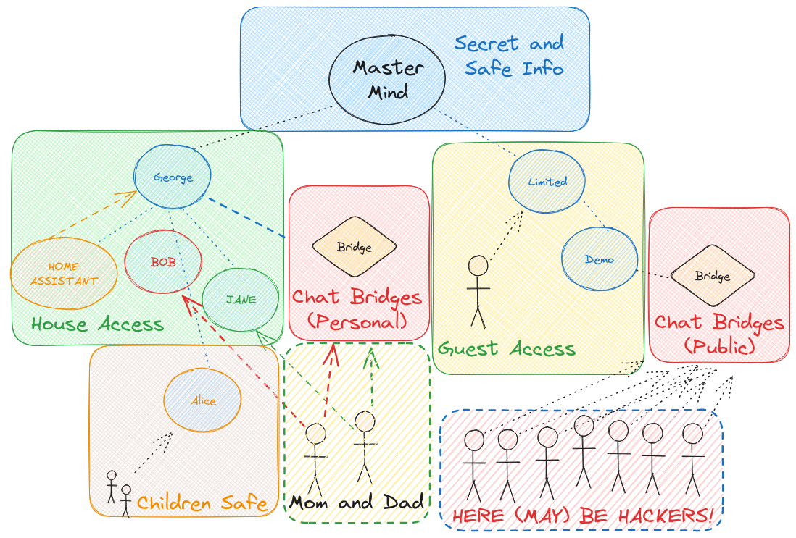

# OpenVoiceOS Skills Server

Hivemind-core is the reference integration with OpenVoiceOS.



> For a minimal install you only need `hivemind-core`, `ovos-core`, and `ovos-messagebus`.

## Install

```bash
pip install hivemind-core
```

## Usage

You manage everything through the `hivemind-core` command. See [pairing](03_pairing.md) for more information.

```shell
hivemind-core --help
Usage: hivemind-core [OPTIONS] COMMAND [ARGS]...

Options:
  --help  Show this message and exit.

Commands:
  add-client     add credentials for a client
  allow-msg      allow message types sent from a client
  delete-client  remove credentials for a client
  list-clients   list clients and credentials
  listen         start listening for HiveMind connections
```

```shell
hivemind-core listen --help
Usage: hivemind-core listen [OPTIONS]

  start listening for HiveMind connections

Options:
  --host TEXT       HiveMind host
  --port INTEGER    HiveMind port number
  --ssl BOOLEAN     use wss://
  --cert_dir TEXT   HiveMind SSL certificate directory
  --cert_name TEXT  HiveMind SSL certificate file name
  --db-backend [redis|json|sqlite]
                                  Select the database backend to use. Options:
                                  redis, sqlite, json.
  --db-name TEXT                  [json/sqlite] The name for the database
                                  file. ~/.cache/hivemind-core/{name}
  --db-folder TEXT                [json/sqlite] The subfolder where database
                                  files are stored. ~/.cache/{db_folder}}
  --redis-host TEXT               [redis] Host for Redis. Default is
                                  localhost.
  --redis-port INTEGER            [redis] Port for Redis. Default is 6379.
  --redis-password TEXT           [redis] Password for Redis. Default None
  --help            Show this message and exit.
```

---

### Why HiveMind?

HiveMind gives OVOS a decentralized setup, with secure communication, device integration, and a documented protocol. Here is what it brings:

- **HiveMind as an OVOS add-on**: start with OVOS by installing [ovos-core](https://github.com/OpenVoiceOS/ovos-core), or use a [Mycroft device](https://www.kickstarter.com/projects/aiforeveryone/mycroft-mark-ii-the-open-voice-assistant). Then run `hivemind-core` to enable HiveMind. This turns your OVOS node into the "brain" of a HiveMind hub.
- **Decentralizing OVOS-Core**: with HiveMind, thin clients like the [voice satellite](https://github.com/JarbasHiveMind/HiveMind-voice-sat) can connect without running the full OVOS software. This allows multiple access points, such as microphones across a home, while the core stays in one central location.
- **Encrypted communication**: HiveMind supports SSL-encrypted communication, so you do not have to manage certificates by hand. It auto-generates self-signed certificates for encrypted connections between devices.
- **MessageBus authentication and security**: HiveMind requires authentication for the message bus, so only authorized clients connect. This protects privacy and stops unauthorized access, unlike a setup where the message bus is left open.
- **Exposing OVOS to the web safely**: HiveMind can expose your OVOS instance securely over the web. Using the [Flask chatroom template](https://github.com/JarbasHiveMind/HiveMind-flask-template), you can interact with OVOS remotely while keeping it private and secure.
- **Protocol for integration**: HiveMind lets you integrate with external platforms like Android, Mattermost, or Twitch. Whether you want OVOS to act as a chatbot or connect to another service, HiveMind provides the protocol.

---

### Key features and setup

- **Devices connecting**: install the HiveMind CLI and register it with your OVOS node to connect devices across your network.
- **Decentralization**: use lightweight devices like a Raspberry Pi with HiveMind to extend OVOS across rooms.
- **Encryption and authentication**: transmit data over SSL, with built-in encryption and message authentication.
- **Web exposure**: use HiveMind's secure web interface to interact with OVOS remotely.
- **Chat integrations**: install bridges like [HackChat](https://github.com/JarbasHiveMind/HiveMind-HackChatBridge) or [Mattermost](https://github.com/JarbasHiveMind/HiveMind_mattermost_bridge) to bring OVOS to chat platforms.

With these features, HiveMind turns OVOS into a decentralized, secure platform for a wide range of use cases and integrations.

---
[Home](index.md)
