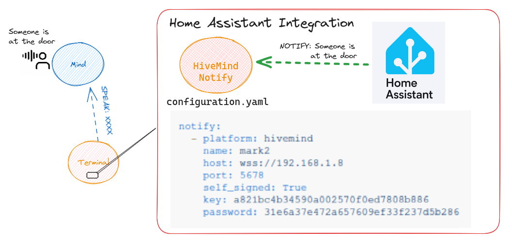

# HomeAssistant Integration



**This component will set up the following actions.**

| Platform | Description                                         |
| -------- |-----------------------------------------------------|
| `notify` | Send a notification to a HiveMind Voice Assistant   |


## Install

Using HACS install from [Github](https://github.com/JarbasHiveMind/hivemind-home-assistant-notify)

## HiveMind setup

create credentials and allow the speak message to be injected hivemind side

you can authorize message_types via the [hivemind-core](https://github.com/JarbasHiveMind/HiveMind-core/) package

```bash
$hivemind-core allow-msg "speak"
```


## Configuration

In `configuration.yaml`:

```yaml

notify:
  - platform: hivemind
    name: mark2
    host: wss://192.168.1.8
    port: 5678
    self_signed: True
    key: a821bc4b34590a002570f0ed7808b886
    password: 31e6a37e472a657609ef33f237d5b286
```

Then call `notify.mark2` with a message you'd like the HiveMind Voice Assistant to speak.


## Manual Installation

1. Using the tool of choice open the directory (folder) for your HA configuration (where you find `configuration.yaml`).
2. If you do not have a `custom_components` directory (folder) there, you need to create it.
3. In the `custom_components` directory (folder) create a new folder called `hivemind`.
4. Download _all_ the files from the `custom_components/hivemind/` directory (folder) in [this repository](https://github.com/JarbasHiveMind/hivemind-home-assistant-notify).
5. Place the files you downloaded in the new directory (folder) you created.
6. Restart Home Assistant
7. In the HA UI go to "Configuration" -> "Integrations" click "+" and search for "HiveMind Integration"

Using your HA configuration directory (folder) as a starting point you should now also have this:

```text
custom_components/hivemind/translations/en.json
custom_components/hivemind/__init__.py
custom_components/hivemind/const.py
custom_components/hivemind/manifest.json
custom_components/hivemind/notify.py
```
