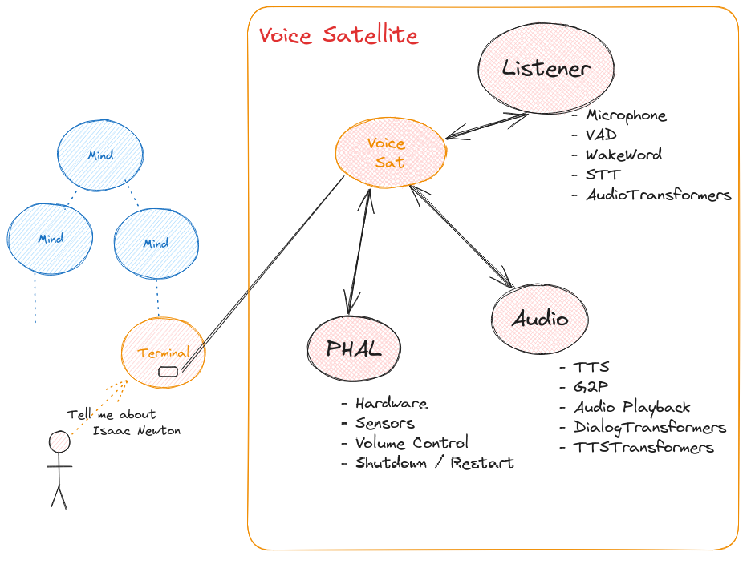

# HiveMind Voice Satellite (voice-sat)

The **Voice Satellite** runs a full OpenVoiceOS audio stack **locally on the device**. All microphone, VAD, wake-word, STT, and TTS processing happens on the satellite. Only **text messages** are sent to HiveMind core, no audio is streamed.

> ⚠️ **No binary plugin is required** on the HiveMind core server. This makes voice-sat fully compatible with a standard HiveMind core setup.

Built on top of [ovos-dinkum-listener](https://github.com/OpenVoiceOS/ovos-dinkum-listener), [ovos-audio](https://openvoiceos.github.io/ovos-technical-manual/audio_service/), and [PHAL](https://openvoiceos.github.io/ovos-technical-manual/PHAL/).



---

## Install

Install dependencies (if needed):

```bash
sudo apt-get install -y libpulse-dev libasound2-dev
```

Install via pip:

```bash
pip install HiveMind-voice-sat
```

---

## Usage

```bash
Usage: hivemind-voice-sat [OPTIONS]

  connect to HiveMind

Options:
  --host TEXT      HiveMind host
  --key TEXT       Access Key
  --password TEXT  Password for key derivation
  --port INTEGER   HiveMind port number
  --selfsigned     Accept self signed certificates
  --help           Show this message and exit.
```

---

## Configuration

The Voice Satellite uses the **standard OpenVoiceOS configuration** at:

```
~/.config/mycroft/mycroft.conf
```

All plugin settings (microphone, VAD, wake word, STT, TTS, G2P, media playback, transformers, PHAL, etc.) are managed through this configuration.

See the [OpenVoiceOS documentation](https://openvoiceos.github.io/ovos-technical-manual/) for detailed plugin setup.

---

## Key Features

* ✅ Fully local audio handling: microphone, VAD, wake word, STT, TTS
* 🔒 Only text is sent over HiveMind
* 📦 Compatible with all OVOS plugins (media, transformers, PHAL, etc.)
* ⚡ Low latency and offline-capable
* 🔗 No HiveMind binary plugin required

---

## Notes

* Wake word detection can be skipped if using [continuous listening mode](https://openvoiceos.github.io/ovos-technical-manual/speech_service/#modes-of-operation).
* Ideal for devices where privacy, offline operation, and low latency are important.
* All HiveMind communication is secure and encrypted.

