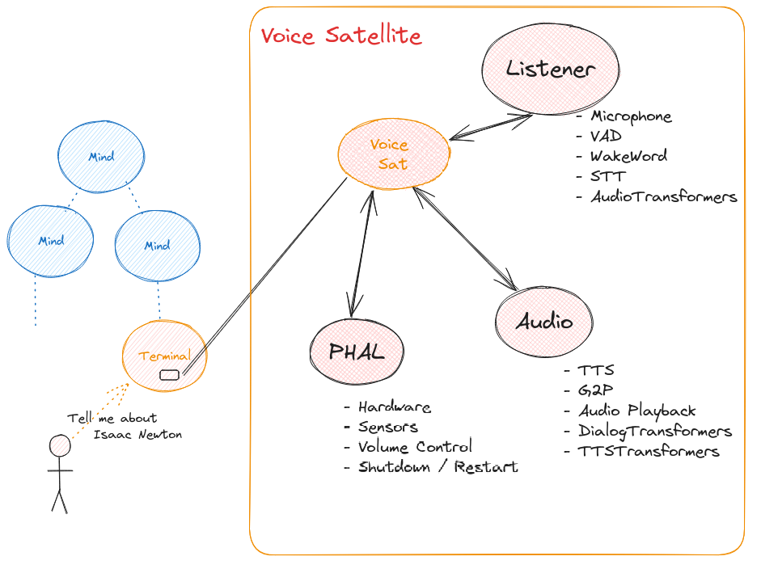

# HiveMind Voice Satellite (voice-sat)

The Voice Satellite runs a full OpenVoiceOS audio stack locally on the device. All microphone, VAD, wake word, STT, and TTS processing happens on the satellite. Only text messages go to HiveMind core; no audio streams over the network.

> No binary plugin is required on the HiveMind core server. This makes voice-sat compatible with a standard HiveMind core setup.

Built on [ovos-dinkum-listener](https://github.com/OpenVoiceOS/ovos-dinkum-listener), [ovos-audio](https://openvoiceos.github.io/ovos-technical-manual/audio_service/), and [PHAL](https://openvoiceos.github.io/ovos-technical-manual/PHAL/).



---

## Install

Install dependencies, if needed:

```bash
sudo apt-get install -y libpulse-dev libasound2-dev
```

Install with pip:

```bash
pip install HiveMind-voice-sat
```

---

## Usage

```bash
Usage: hivemind-voice-sat [OPTIONS]

  connect to HiveMind

Options:
  --host TEXT      HiveMind host
  --key TEXT       Access Key
  --password TEXT  Password for key derivation
  --port INTEGER   HiveMind port number
  --selfsigned     Accept self signed certificates
  --help           Show this message and exit.
```

---

## Configuration

The Voice Satellite uses the standard OpenVoiceOS configuration at:

```
~/.config/mycroft/mycroft.conf
```

This file manages all plugin settings: microphone, VAD, wake word, STT, TTS, G2P, media playback, transformers, PHAL, and more.

See the [OpenVoiceOS documentation](https://openvoiceos.github.io/ovos-technical-manual/) for detailed plugin setup.

---

## Key features

- Fully local audio handling: microphone, VAD, wake word, STT, TTS.
- Only text goes over HiveMind.
- Compatible with all OVOS plugins, including media, transformers, and PHAL.
- Low latency and offline-capable.
- No HiveMind binary plugin required.

---

## Notes

- You can skip wake word detection with [continuous listening mode](https://openvoiceos.github.io/ovos-technical-manual/speech_service/#modes-of-operation).
- This satellite fits devices where privacy, offline operation, and low latency matter most.
- All HiveMind communication is secure and encrypted.

---
[← Overview](satellites.md) · [Home](index.md) · [Voice Relay →](07_voice_relay.md)
