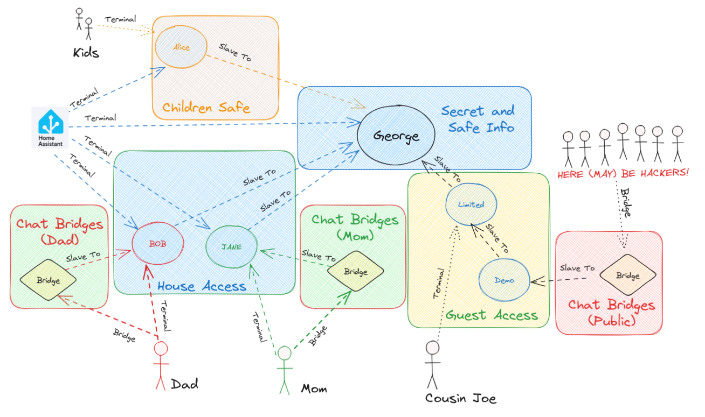

# Persona

this is a hivemind Master node, but it is running [ovos-persona](https://github.com/OpenVoiceOS/ovos-persona) instead of connecting to ovos-core

you can use this to expose chatbots and LLMs via hivemind, satellites made for `hivemind-core` should be compatible

> ⚠️ Satellites made specifically for `hivemind-listener` (Sound server) will not work with `hivemind-persona`!




## Install

```bash
pip install hivemind-persona
```

## ChatGPT

Install the [OpenAI solver](https://github.com/OpenVoiceOS/ovos-solver-plugin-openai-persona/)

create a chatgpt.json
```json
{
"name": "ChatGPT",
"solvers": [
    "ovos-solver-openai-persona-plugin"
],
"ovos-solver-openai-persona-plugin": {
    "api_url": "<your_local_LocalAI_server_url>",
    "key": "<your_OpenAI_key>",
    "persona": "helpful, creative, clever, and very friendly."
}
}
```

launch hivemind-persona with the created file

`hivemind-persona --persona chatgpt.json`
