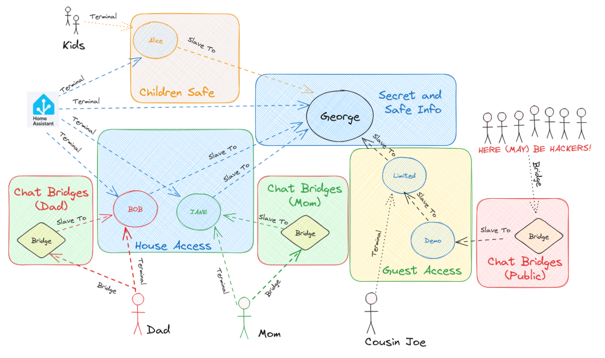

# Persona


The standalone `hivemind-persona` package is superseded. Its last release, 0.0.2 from
December 2024, pins `hivemind-core<2.0.0`, and the current core is 4.x. Persona is now
an agent plugin that `hivemind-core` loads. Point `agent_protocol` at
`hivemind-persona-agent-plugin` in `~/.config/hivemind-core/server.json`.


This is a HiveMind master node that runs [ovos-persona](https://github.com/OpenVoiceOS/ovos-persona) instead of connecting to ovos-core.

Use it to expose chatbots and LLMs over HiveMind. Satellites made for `hivemind-core` should be compatible.

> Satellites made specifically for `hivemind-listener` (the sound server) do not work with `hivemind-persona`.



## Install

```bash
pip install hivemind-core hivemind-persona-agent-plugin
```

## ChatGPT

Install the [OpenAI solver](https://github.com/OpenVoiceOS/ovos-solver-plugin-openai-persona/).

Create a `chatgpt.json`:
```json
{
"name": "ChatGPT",
"solvers": [
    "ovos-solver-openai-persona-plugin"
],
"ovos-solver-openai-persona-plugin": {
    "api_url": "<your_local_LocalAI_server_url>",
    "key": "<your_OpenAI_key>",
    "persona": "helpful, creative, clever, and very friendly."
}
}
```

Launch hivemind-persona with the file:

`hivemind-persona --persona chatgpt.json`

---
[Home](index.md)
