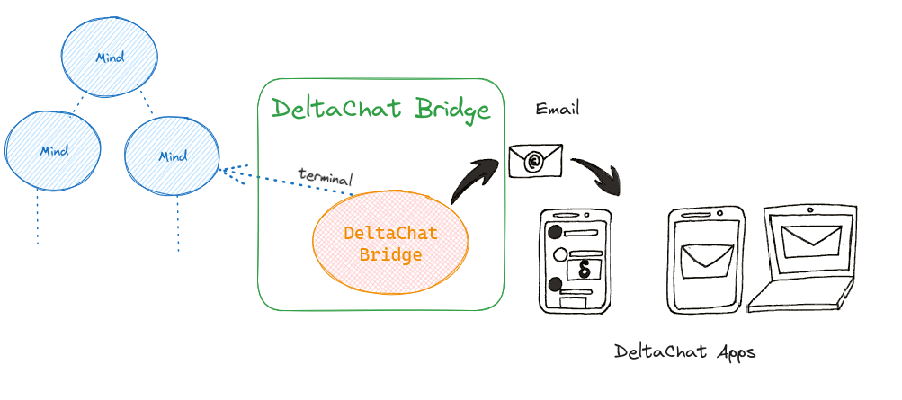

# HiveMind - Matrix bridge

What is it?

[Matrix](https://matrix.org/) is a chat protocol, it works a little like email, but instantaneous and secure:

- You need to register an account at a provider

- Whatever your provider is, you can talk to people using other providers

- In the same way you can use Outlook or Thunderbird with the same email account, you can use different Matrix apps for the same Matrix account.




## Install

Install from [Github](https://github.com/JarbasHiveMind/HiveMind-matrix-bridge)

## Usage


```
Usage: HiveMind-matrix run [OPTIONS]

  connect a matrix chatroom to hivemind

Options:
  --botname TEXT      thehivebot
  --matrixtoken TEXT  syt_dGhl.....
  --matrixhost TEXT   https://matrix.org
  --room TEXT         #hivemind-bots:matrix.org
  --key TEXT          HiveMind access key (default read from identity file)
  --password TEXT     HiveMind password (default read from identity file)
  --host TEXT         HiveMind host (default read from identity file)
  --port INTEGER      HiveMind port number (default: 5678)
  --help              Show this message and exit.

```