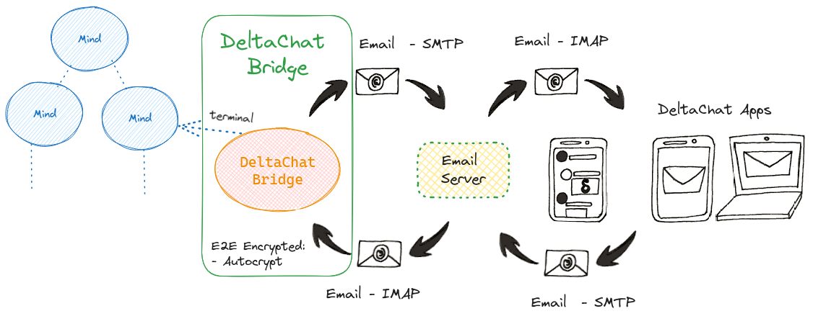

# DeltaChat Bridge

[Delta Chat](https://delta.chat/en/) is a messaging app that works over e-mail

End-to-End Encryption using [Autocrypt](https://autocrypt.org/) and [CounterMITM](https://countermitm.readthedocs.io/en/latest/new.html) protocols, with multiple security audits.



## Install

```bash
$ pip install HiveMind-deltachat-bridge
```
## Usage


```bash
$ hm-deltachat-bridge --help

usage: __main__.py [-h] --access_key ACCESS_KEY --email EMAIL --password
                   PASSWORD [--crypto_key CRYPTO_KEY] [--name NAME]
                   [--host HOST] [--port PORT]

optional arguments:
  -h, --help            show this help message and exit
  --access_key ACCESS_KEY
                        hivemind access key
  --email EMAIL         deltachat email
  --password PASSWORD   deltachat password
  --crypto_key CRYPTO_KEY
                        payload encryption key
  --name NAME           human readable device name
  --host HOST           HiveMind host
  --port PORT           HiveMind port number
```
