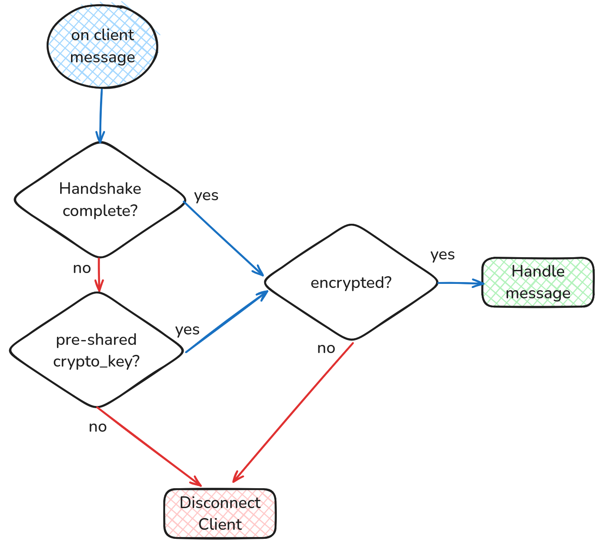

# Handshake Protocol

This document provides an overview of the handshake protocol used in the HiveMind system, detailing how handshakes are initiated and processed from both the client (slave) and server (master) perspectives.

The handshake process establishes a secure connection between a HiveMind master and its slaves. It ensures authentication, optionally using passwords or public/private key pairs, and sets up cryptographic keys for secure communication.

For detailed code and various usage examples, you can refer to the [Poorman Handshake GitHub Repository](https://github.com/JarbasHiveMind/poorman_handshake).

---

## Handshake Types

**Password-Based Handshake**:

   - Utilizes a shared password for authentication.

   - Requires both client and server to know the password beforehand.

**RSA (Public Key) Handshake**:

   - Based on public/private key pairs.

   - The server provides a public key to the client, and the client verifies the server's authenticity.

   - Supports implicit trust for first-time connections (when no previous public key is available).

   - Uses asymmetric encryption to ensure that communication is secure and cannot be intercepted or modified.

   - The symmetric session key (AES) for further communication is transmitted encrypted with RSA public keys.

> ⚠️ RSA Handshake is a work in progress! 🚧

---

## Workflow: Server Perspective

#### **Send Server Info** `HELLO` ✉️ ➡️  

- **Trigger**: Sent immediately upon connection establishment.  
- **Content**:
      - **`pubkey`**: Public key for key-based handshake and `INTERCOM` messages.  
      - **`node_id`**: A user-friendly identifier for the server.  
- **Security**: This message is **NOT ENCRYPTED** 🔓.  

#### **Establish connection parameters** `HANDSHAKE`✉️ ➡️  

- **Trigger**: Initiates the handshake process immediately after `HELLO` message.  
- **Content**:
    - **`handshake`**: Indicates if the connection will be dropped if the client does not finalize the handshake.  
    - **`binarize`**: Specifies if the server supports the binarization protocol.  
    - **`preshared_key`**: Indicates the availability of a pre-shared key.  
    - **`password`**: Indicates the availability of password-based handshake.  
    - **`crypto_required`**: Specifies if unencrypted messages will be dropped.  
    - **`min_protocol_version`**: The minimum supported HiveMind protocol version.  
    - **`max_protocol_version`**: The maximum supported HiveMind protocol version.  
- **Security**: This message is **NOT ENCRYPTED** 🔓.  

#### **Initiate Key Exchange**  ⬅️ ✉️  `HANDSHAKE`

- **Trigger**: Client initiated handshake in response to previously sent connection parameters.  
- **Content**:
     - **`binarize`**: Specifies if the client supports the binarization protocol.  
     - **`envelope`**: The handshake envelope to be validated by the server.  
- **Behavior**:  
     - If the client does not respond, the server will skip the handshake step and use the pre-shared cryptographic key directly.  
     - Validate the client's `envelope` using the pre-shared password.  
- **Security**: This message is **NOT ENCRYPTED** 🔓.  

#### **Complete Key Exchange** `HANDSHAKE` ✉️ ➡️  

- **Trigger**: Validated client's `envelope` and updated the cryptographic key for secure communication.
- **Content**:
     - **`envelope`**: The handshake envelope to be validated by the client.  
- **Security**: This message is **NOT ENCRYPTED** 🔓.  

#### **Receive Client Info** ⬅️ ✉️ `HELLO`

- **Trigger**: Sent after the handshake is complete and encryption is established.  
- **Content**:
    - **`session`**: The client session data.  
    - **`site_id`**: The client site identifier.  
    - **`pubkey`**: Public key for `INTERCOM` messages.  
- **Security**: This message is **ENCRYPTED** 🔐.  

---

## Workflow: Client Perspective

#### **Receive Server Info** ⬅️ ✉️  `HELLO`

- **Trigger**: Received upon connection establishment.  
- **Content**:
     - **`pubkey`**: The server's public RSA key.  
    - **`node_id`**: A user-friendly identifier for the server.  
- **Security**: This message is **NOT ENCRYPTED** 🔓.  

#### **Establish connection parameters** ⬅️ ✉️  `HANDSHAKE`

- **Trigger**: Received immediately after `HELLO` message.  
- **Content**:
     - **`handshake`**: Indicates if the connection will be dropped if the client does not finalize the handshake.  
    - **`binarize`**: Specifies if the server supports the binarization protocol.  
    - **`preshared_key`**: Indicates the availability of a pre-shared key.  
    - **`password`**: Indicates the availability of password-based handshake.  
    - **`crypto_required`**: Specifies if unencrypted messages will be dropped.  
    - **`min_protocol_version`**: The minimum supported HiveMind protocol version.  
    - **`max_protocol_version`**: The maximum supported HiveMind protocol version.  
- **Security**: This message is **NOT ENCRYPTED** 🔓.  

#### **Initiate Key Exchange** `HANDSHAKE` ✉️ ➡️  

- **Trigger**: Respond to the server's handshake request.  
- **Content**:
     - **`binarize`**: Specifies if the client supports the binarization protocol.  
    - **`envelope`**: The handshake envelope to be validated by the server.  
- **Security**: This message is **NOT ENCRYPTED** 🔓.  

#### **Complete Key Exchange** ⬅️ ✉️  `HANDSHAKE`

- **Trigger**: On reception of the server's final `HANDSHAKE` message.  
- **Content**:
    - **`envelope`**: The handshake envelope to be validated by the client.  
- **Behavior**:
    - Verify the server's authenticity using the shared password.  
    - Update the cryptographic key for secure communication.  
- **Security**: This message is **NOT ENCRYPTED** 🔓.  

#### **Send Session Data** `HELLO` ✉️ ➡️  

- **Trigger**: Send session data after encryption is established.  
- **Content**:
     - **`session`**: The client session data.  
    - **`site_id`**: The client site identifier.  
    - **`pubkey`**: Public key for `INTERCOM` messages.  
- **Security**: This message is **ENCRYPTED** 🔐.  

---

## Secure Communication After Handshake

Upon successful handshake:

1. A shared cryptographic key is established between the server and the client.

2. All further communication between the server and client is encrypted using this symmetric key (AES-256).

3. The session ID ensures continuity and identification in multi-session environments.

This guarantees that all data exchanged between the server and the client is protected, even if intercepted by a third party.

---

## Error Handling

**Illegal Messages**:

  - Messages not adhering to the protocol are logged, and the connection may be terminated.

**Authentication Failures**:

  - Authentication failures result in handshake termination and rejection of the connection.

**Skipping Handshake**:

  - Handshake can be skipped if a secret key has been previously exchanged out of band

---

## Algorithm Details: Password-Based Handshake

The password-based handshake (the most common mode) uses **PBKDF2** for key derivation.

**Source**: `poorman_handshake` package

### Key Derivation Function (PBKDF2)

PBKDF2 (Password-Based Key Derivation Function 2) transforms a password and unique salt into a 256-bit symmetric key:

- **Iterations**: 100,000 (configurable in `poorman_handshake.symmetric.pbkdf2.PBKDF2HandShake`)
- **Hash Algorithm**: SHA-256
- **Salt Generation**: A new, random salt is generated for every handshake in `generate_handshake()`, ensuring different sessions using the same password have different session keys
- **Output**: 256-bit symmetric key for AES-256-GCM

### Session Key Usage

Once derived via `PasswordHandShake.secret` property, the session key is used for AES-256-GCM encryption:

- **Confidentiality**: Standard AES-256 encryption
- **Integrity**: GCM (Galois/Counter Mode) provides message authentication codes (MAC)
- **Initialization Vector (IV)**: A unique, 12-byte IV for every encrypted message

### Password Strength

Security is directly proportional to password entropy:

- **Minimum**: 12+ characters with mixed case, numbers, symbols
- **Recommended**: Use a passphrase or generated cryptographically random string
- **Never**: Hardcode passwords; use environment variables or secure credential stores
- **Rotation**: Session keys are inherently short-lived — a new key is negotiated on every reconnection

---

## Security Best Practices

**Source**: `poorman_handshake/docs/security_best_practices.md`

### For Password-Based Connections

1. **Strong passwords**: Use high-entropy pre-shared passwords; leverage environment variable injection in deployment.
2. **Salt uniqueness**: PBKDF2 generates a new salt for each handshake, preventing rainbow table attacks.
3. **Session key lifetime**: Keys live only for the duration of a connection; reconnection forces key renegotiation.

### For PGP (Asymmetric) Connections

1. **Private key protection**: Always protect your PGP private key with a strong passphrase.
2. **Key verification**: Manually verify public keys through a trusted channel to prevent MITM attacks.
3. **Key rotation**: Periodically rotate long-lived keys.

### Network Best Practices

1. **TLS/SSL**: Run HiveMind with SSL enabled (`ssl: true` in `server.json`) to add an additional transport layer.
2. **Firewall isolation**: Restrict HiveMind ports to trusted networks.
3. **Monitoring**: Log and monitor failed handshakes for intrusion attempts.

---

For detailed code and various usage examples, please refer to the [Poorman Handshake GitHub Repository](https://github.com/JarbasHiveMind/poorman_handshake).