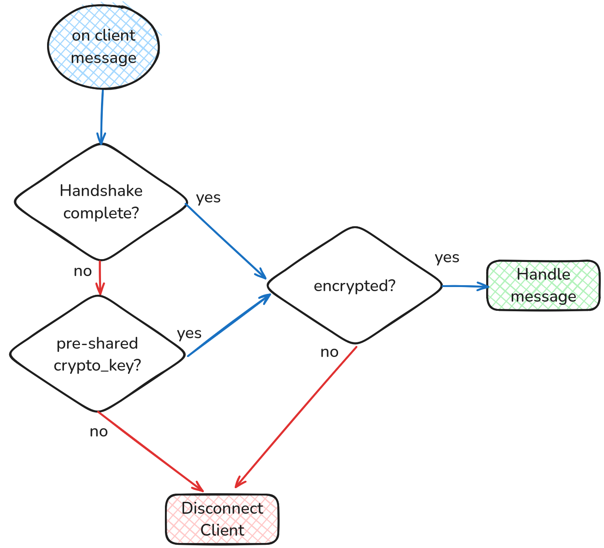

# Handshake Protocol

This page describes the handshake protocol used in the HiveMind system, and how handshakes are initiated and processed from both the client (slave) and server (master) side.

The handshake process establishes a secure connection between a HiveMind master and its slaves. It authenticates each side, optionally with passwords or public/private key pairs, and sets up cryptographic keys for secure communication.

For code and usage examples, see the [Poorman Handshake GitHub repository](https://github.com/JarbasHiveMind/poorman_handshake).

---

## Handshake types

**Password-based handshake**:

- Uses a shared password for authentication.
- Requires both client and server to know the password beforehand.

**RSA (public key) handshake**:

- Based on public/private key pairs.
- The server provides a public key to the client, and the client verifies the server's authenticity.
- Supports implicit trust on first connection, when no previous public key is available.
- Uses asymmetric encryption, so communication cannot be intercepted or modified.
- Transmits the symmetric session key (AES) for further communication, encrypted with RSA public keys.

> RSA Handshake is a work in progress.

---

## Workflow: server perspective

#### Send server info: `HELLO`

- **Trigger**: sent immediately after the connection is established.
- **Content**:
      - `pubkey`: public key for key-based handshake and `INTERCOM` messages.
      - `node_id`: a user-friendly identifier for the server.
- **Security**: this message is not encrypted.

#### Establish connection parameters: `HANDSHAKE`

- **Trigger**: starts the handshake process immediately after the `HELLO` message.
- **Content**:
    - `handshake`: indicates whether the connection drops if the client does not finalize the handshake.
    - `binarize`: specifies if the server supports the binarization protocol.
    - `preshared_key`: indicates whether a pre-shared key is available.
    - `password`: indicates whether password-based handshake is available.
    - `crypto_required`: specifies if unencrypted messages get dropped.
    - `min_protocol_version`: the minimum supported HiveMind protocol version.
    - `max_protocol_version`: the maximum supported HiveMind protocol version.
- **Security**: this message is not encrypted.

#### Initiate key exchange: `HANDSHAKE`

- **Trigger**: the client initiates the handshake in response to the connection parameters.
- **Content**:
     - `binarize`: specifies if the client supports the binarization protocol.
     - `envelope`: the handshake envelope for the server to validate.
- **Behavior**:
     - If the client does not respond, the server skips the handshake step and uses the pre-shared cryptographic key directly.
     - The server validates the client's `envelope` with the pre-shared password.
- **Security**: this message is not encrypted.

#### Complete key exchange: `HANDSHAKE`

- **Trigger**: the server validates the client's `envelope` and updates the cryptographic key for secure communication.
- **Content**:
     - `envelope`: the handshake envelope for the client to validate.
- **Security**: this message is not encrypted.

#### Receive client info: `HELLO`

- **Trigger**: sent after the handshake completes and encryption is established.
- **Content**:
    - `session`: the client session data.
    - `site_id`: the client site identifier.
    - `pubkey`: public key for `INTERCOM` messages.
- **Security**: this message is encrypted.

---

## Workflow: client perspective

#### Receive server info: `HELLO`

- **Trigger**: received when the connection is established.
- **Content**:
     - `pubkey`: the server's public RSA key.
     - `node_id`: a user-friendly identifier for the server.
- **Security**: this message is not encrypted.

#### Establish connection parameters: `HANDSHAKE`

- **Trigger**: received immediately after the `HELLO` message.
- **Content**:
     - `handshake`: indicates whether the connection drops if the client does not finalize the handshake.
     - `binarize`: specifies if the server supports the binarization protocol.
     - `preshared_key`: indicates whether a pre-shared key is available.
     - `password`: indicates whether password-based handshake is available.
     - `crypto_required`: specifies if unencrypted messages get dropped.
     - `min_protocol_version`: the minimum supported HiveMind protocol version.
     - `max_protocol_version`: the maximum supported HiveMind protocol version.
- **Security**: this message is not encrypted.

#### Initiate key exchange: `HANDSHAKE`

- **Trigger**: responds to the server's handshake request.
- **Content**:
     - `binarize`: specifies if the client supports the binarization protocol.
     - `envelope`: the handshake envelope for the server to validate.
- **Security**: this message is not encrypted.

#### Complete key exchange: `HANDSHAKE`

- **Trigger**: received on the server's final `HANDSHAKE` message.
- **Content**:
    - `envelope`: the handshake envelope for the client to validate.
- **Behavior**:
    - The client verifies the server's authenticity with the shared password.
    - The client updates the cryptographic key for secure communication.
- **Security**: this message is not encrypted.

#### Send session data: `HELLO`

- **Trigger**: sent after encryption is established.
- **Content**:
     - `session`: the client session data.
     - `site_id`: the client site identifier.
     - `pubkey`: public key for `INTERCOM` messages.
- **Security**: this message is encrypted.

---

## Secure communication after handshake

Once the handshake completes:

1. The server and client share a cryptographic key.
2. All further communication between them uses this symmetric key (AES-256).
3. The session ID keeps continuity and identification in multi-session environments.

This protects all data exchanged between the server and client, even if a third party intercepts it.

---

## Error handling

**Illegal messages**:

  - HiveMind logs messages that do not follow the protocol, and may terminate the connection.

**Authentication failures**:

  - Authentication failures end the handshake and reject the connection.

**Skipping handshake**:

  - HiveMind can skip the handshake if the two sides already exchanged a secret key out of band.

---

For code and usage examples, see the [Poorman Handshake GitHub repository](https://github.com/JarbasHiveMind/poorman_handshake).

---
[← Permissions](16_permissions.md) · [Home](index.md) · [Encryption →](19_crypto.md)
