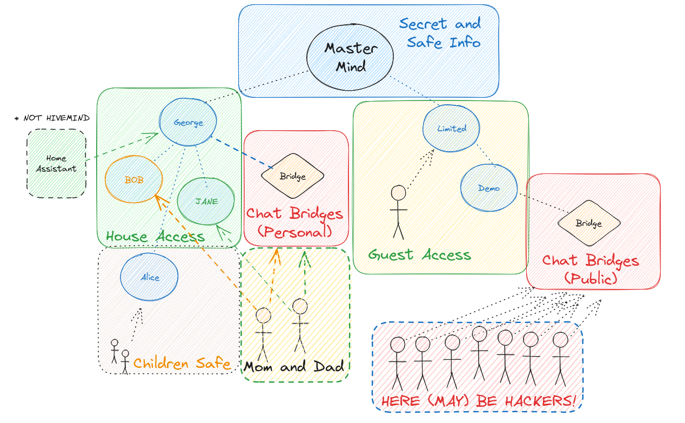

# LocalHive

> **Proof of concept**: not actively maintained.



LocalHive is a hardened OpenVoiceOS skills service. It replaces the messagebus with a HiveMind connection.

*Coming soon - [GitHub](https://github.com/JarbasHiveMind/LocalHive)*

_"security as a requirement, not a feature"_

- LocalHive is HTTP only.
- LocalHive uses no crypto.
- LocalHive does not require an access key. It only accepts connections from 0.0.0.0.
- LocalHive rejects all connections not coming from 0.0.0.0.
- LocalHive runs on port 6989.
- Skills cannot listen to each other's traffic.
- Skills can only inject whitelisted messages to LocalHive (by default intents, converse, and speak).
- By default, skills only register and trigger intents, nothing else.
- Each skill can run in its own `.venv` with its own requirements.
- TODO: skills should be able to request to listen for specific messages. Cross-skill communication is currently impossible.

## Permissions

Skills need explicit authorization to send each message type.

```python
UTTERANCES = ["recognizer_loop:utterance"]
INTENTS = [
    "mycroft.skill.handler.start",
    "mycroft.skill.handler.complete",
    "intent.service.intent.get",
    "intent.service.skills.get",
    "intent.service.active_skills.get",
    "intent.service.adapt.get",
    "intent.service.padatious.get",
    "intent.service.adapt.manifest.get",
    "intent.service.padatious.manifest.get",
    "intent.service.adapt.vocab.manifest.get",
    "intent.service.padatious.entities.manifest.get",
    "register_vocab",
    "register_intent",
    "detach_intent",
    "detach_skill",
    "add_context",
    "remove_context",
    "clear_context",
    'padatious:register_intent',
    'padatious:register_entity',
    "mycroft.skill.set_cross_context",
    "mycroft.skill.remove_cross_context"
]
CONVERSE = [
    "skill.converse.response",
    "skill.converse.pong",
    "active_skill_request",
    "intent.service.skills.activated",
    "intent.service.skills.deactivated",
]
SPEAK = ["speak"]
STOP = ["mycroft.stop"]

DEFAULT = INTENTS + \
          CONVERSE + \
          SPEAK + \
          ["mycroft.skills.loaded"]
```

### Per-skill permissions

You can allow new messages per skill ID by editing the JSON file at `~/.config/LocalHive/skill_permissions.json`:

```
{
    "ovos-stop.openvoiceos": ["mycroft.stop"]
}
```

## Usage

At this stage of development, you need to write Python scripts that interface with the existing code directly.

### Running LocalHive

```python
from local_hive.service import LocalHiveService
from ovos_utils import wait_for_exit_signal
if __name__ == "__main__":
    localmind = LocalHiveService()
    localmind.start()
    wait_for_exit_signal()
```

### Connecting a skill

```python
from local_hive.loader import HiveMindExternalSkillWrapper
from ovos_utils import wait_for_exit_signal
from os.path import join, dirname
path = join(dirname(__file__), "test_skills", "mycroft-joke.mycroftai")
skill = HiveMindExternalSkillWrapper(path)
wait_for_exit_signal()
"""
2021-05-14 03:23:50.059 | INFO     | 44310 | HiveMind-websocket-client | Connected
2021-05-14 03:23:50.111 | INFO     | 44310 | mycroft.skills.settings:get_local_settings:83 | /home/user/.config/mycroft/skills/mycroft-joke.mycroftai/settings.json
"""
```

---
[Home](index.md)
