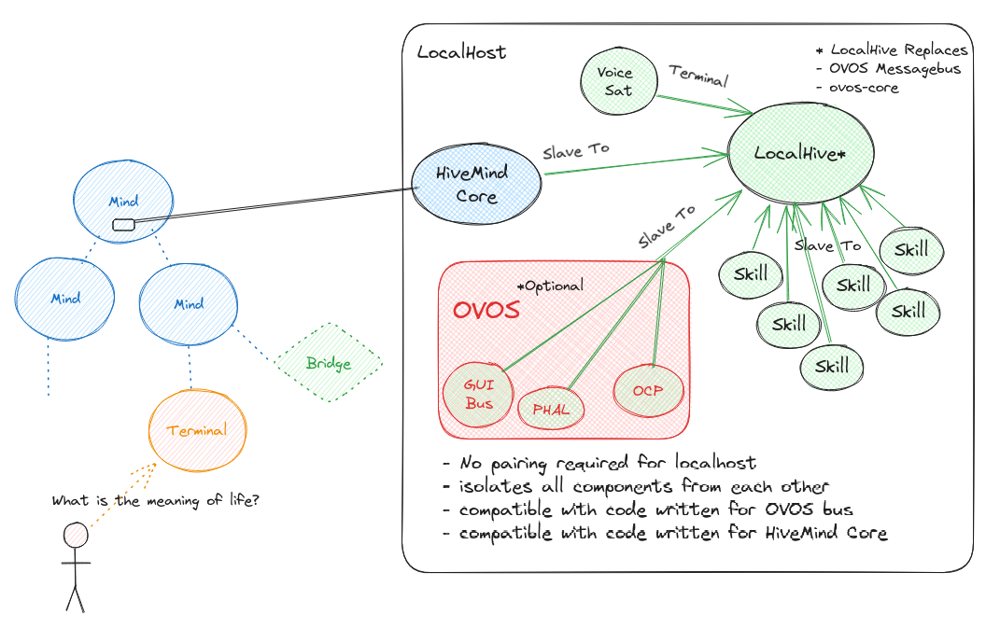

# LocalHive



The LocalHive is a hardened OpenVoiceOS skills service, the messagebus is replaced with a hivemind connection

*Coming Soon - [Github](https://github.com/JarbasHiveMind/LocalHive)

_"security as a requirement, not a feature"_

- the LocalHive is HTTP only
- the LocalHive uses no crypto
- the LocalHive does not require accessKey, instead it only accepts connections coming from 0.0.0.0
- the LocalHive rejects all connections not coming from 0.0.0.0
- the LocalHive runs in port 6989
- skills can not listen to each other's traffic
- skills can only inject whitelisted messages to LocalHive (by default intents + converse + speak)
- by default skills only register and trigger intents, nothing else
- each skill can run in it's own .venv with it's own requirements
- TODO - skills should be able to request to listen for specific messages, cross skill communication is currently impossible

## Permissions

skills need to be explicitly authorizes to send each message_type

```python
UTTERANCES = ["recognizer_loop:utterance"]
INTENTS = [
    "mycroft.skill.handler.start",
    "mycroft.skill.handler.complete",
    "intent.service.intent.get",
    "intent.service.skills.get",
    "intent.service.active_skills.get",
    "intent.service.adapt.get",
    "intent.service.padatious.get",
    "intent.service.adapt.manifest.get",
    "intent.service.padatious.manifest.get",
    "intent.service.adapt.vocab.manifest.get",
    "intent.service.padatious.entities.manifest.get",
    "register_vocab",
    "register_intent",
    "detach_intent",
    "detach_skill",
    "add_context",
    "remove_context",
    "clear_context",
    'padatious:register_intent',
    'padatious:register_entity',
    "mycroft.skill.set_cross_context",
    "mycroft.skill.remove_cross_context"
]
CONVERSE = [
    "skill.converse.response",
    "skill.converse.pong",
    "active_skill_request",
    "intent.service.skills.activated",
    "intent.service.skills.deactivated",
]
SPEAK = ["speak"]
STOP = ["mycroft.stop"]

DEFAULT = INTENTS + \
          CONVERSE + \
          SPEAK + \
          ["mycroft.skills.loaded"]
```

### Per Skill Permissions

you can allow new messages per skill_id by editing the json file at `~/.config/LocalHive/skill_permissions.json`

```
{
    "ovos-stop.openvoiceos": ["mycroft.stop"]
}
```

## Usage

At this point of development you need to create python scripts to directly interface with the existing code

### Running LocalHive

```python
from local_hive.service import LocalHiveService
from ovos_utils import wait_for_exit_signal

if __name__ == "__main__":
    localmind = LocalHiveService()
    localmind.start()
    wait_for_exit_signal()

```

### Connecting a skill

```python
from local_hive.loader import HiveMindExternalSkillWrapper
from ovos_utils import wait_for_exit_signal
from os.path import join, dirname

path = join(dirname(__file__), "test_skills", "mycroft-joke.mycroftai")

skill = HiveMindExternalSkillWrapper(path)

wait_for_exit_signal()

"""
2021-05-14 03:23:50.059 | INFO     | 44310 | HiveMind-websocket-client | Connected
2021-05-14 03:23:50.111 | INFO     | 44310 | mycroft.skills.settings:get_local_settings:83 | /home/user/.config/mycroft/skills/mycroft-joke.mycroftai/settings.json
"""
```