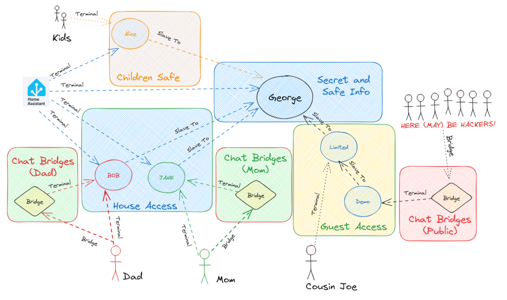

### Nested Hives

Now that you have a basic hive setup, you can add more Minds to it and connect them to each other.

To better understand how minds can interact with each read [the protocol](./04_protocol.md)

## Nested Hiveminds in Action

To illustrate the power of nested Hiveminds, let's consider a scenario where two housemates, let's call them Mom and Dad, each have their own AI assistant running on OpenVoiceOS, named John and Jane, respectively.

While sharing a house and most of their IoT devices, Mom and Dad want to ensure that their AI assistants can control the smart home individually without interfering with each other's commands. To achieve this, they create a Hive for their house, naming it George, with at least one instance of OpenVoiceOS acting as the brain.

Mom and Dad then connect their AI assistants, John and Jane, as clients to the George Hive. This setup allows John and Jane to communicate with George individually but not directly with each other. Instead, their messages pass through George, which acts as an intermediary, ensuring proper communication flow.

Now, when Dad instructs his AI assistant to adjust the lights, the message goes through George. Similarly, when Mom asks her AI assistant to set the temperature, the command is routed through George. George becomes the central point of control for the shared devices, enabling independent control for John and Jane.

Moreover, if guests visit their house, Mom and Dad can grant them access to George directly, for example by using the voice satellites around the house, or they can create a guest Hive under George temporarily. 

This flexibility allows for easy integration and disconnection of Hives as required.

Nested Hiveminds offer a dynamic and adaptable environment for managing AI systems and devices. 

It is important to note that as soon as a Hive is decoupled, such as when  Mom and Dad split their Hives, they become their own independent Masters again. 

This hierarchical organization, with clusters nested within a Master Hive, provides a scalable and efficient framework for controlling AI instances and devices.

## Permissions

Let's further explore the practical applications of nested Hiveminds by introducing another scenario. Imagine that Mom and Dad have a guest staying with them, and this guest, Bob, also has his own AI assistant. To provide Bob with access to the shared smart home functionalities, they allow Bob's AI assistant to connect to the George Hive as a client.

However, Mom and Dad want to ensure that Bob's AI assistant has limited permissions within their ecosystem. They configure hivemind-core, acting as a firewall, to restrict Bob's assistant from placing orders or accessing sensitive information from Mom and Dad. This fine-grained control ensures that the guest AI operates within defined boundaries, maintaining privacy and security for all parties involved.

Furthermore, consider a scenario where Mom and Dad have children. They can create a separate nested assistant for their kids, granting them access to specific functionalities suitable for their age and requirements. This nested assistant for the kids would have limited permissions and tailored interactions, providing a safe and engaging AI experience while keeping their privacy intact.

Nested Hiveminds offer a versatile framework for managing multiple AI assistants and customizing their capabilities based on individual needs and preferences. 

By configuring access permissions and setting up appropriate firewalls, users can create an ecosystem that ensures privacy, security, and personalized experiences for each participant.

