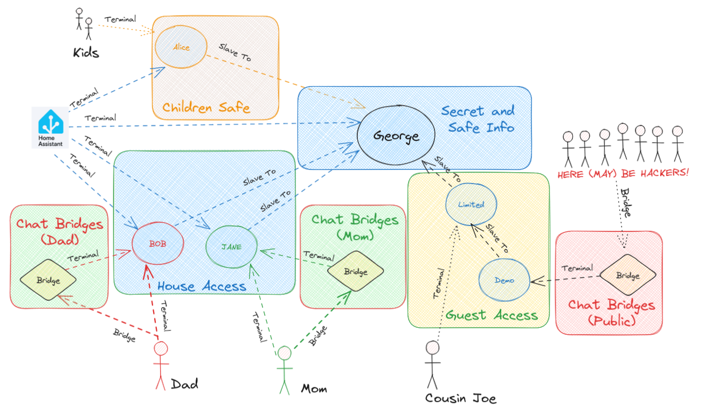

### Nested Hives

Once you have a basic hive set up, you can add more Minds to it and connect them to each other.

Read [the protocol page](04_protocol.md) to learn how minds interact.

## Nested Hiveminds in action

Consider two housemates, Mom and Dad, who each have an AI assistant running on OpenVoiceOS, named John and Jane.

Mom and Dad share a house and most of their IoT devices. They want their assistants to control the smart home individually, without interfering with each other's commands. To do this, they create a hive for their house, named George, with at least one OpenVoiceOS instance acting as the brain.

Mom and Dad connect John and Jane as clients to the George hive. This setup lets John and Jane talk to George individually, not directly with each other. Their messages pass through George, which acts as an intermediary and keeps communication in order. John is connected to Dad's phone and calendar, and knows Dad's favorite songs. This keeps George free of personal data and gives Dad a personalized experience. The same holds for Jane and Mom: alarms and music playlists stay separate.

As soon as a hive is decoupled, such as when Mom and Dad split their hives, each side becomes an independent master again.

When Dad tells his assistant to adjust the lights, the message goes through George. When Mom tells her assistant to set the temperature, the command routes through George too. George becomes the central point of control for shared devices, while John and Jane still work independently.

If guests visit, Mom and Dad can grant them access to George directly, for example through the voice satellites around the house, or create a temporary guest hive under George.

This setup lets Mom and Dad connect and disconnect hives as needed.

Nested hiveminds give you a flexible way to manage AI systems and devices. Clusters nested within a master hive form a scalable, hierarchical structure.

## Permissions

Consider another scenario to explore nested hiveminds further. Suppose Mom and Dad have a guest, Bob, who also has his own AI assistant. To give Bob access to the shared smart home functions, they let Bob's assistant connect to the George hive as a client.

Mom and Dad still want to limit Bob's assistant's permissions within their ecosystem. They configure hivemind-core, acting as a firewall, to stop Bob's assistant from placing orders or reading sensitive information belonging to Mom and Dad. This fine-grained control keeps the guest AI within defined boundaries, so privacy and security hold for everyone involved.

Mom and Dad can also create a separate nested assistant for their children, with access limited to functions suitable for their age. This nested assistant has restricted permissions and tailored interactions, so kids get a safe AI experience while their privacy stays intact.

Nested hiveminds give you a versatile way to manage multiple AI assistants and tailor their capabilities to each person's needs. By configuring access permissions and firewalls, you can build an ecosystem that keeps privacy, security, and a personalized experience for each participant.

---
[← Terminology](02_terminology.md) · [Home](index.md) · [Plugins →](04_plugins.md)
