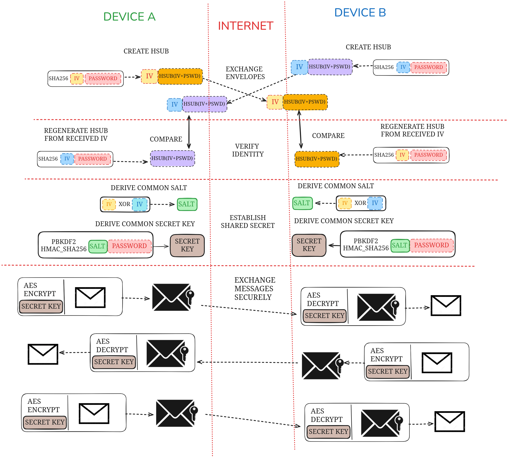

# Encryption

HiveMind ensures secure communication between devices by using modern cryptographic techniques. This page provides an overview of how messages are encrypted in transit, the structure of encrypted messages, and the process of encryption key generation.

- **End-to-End Encryption**: Messages are encrypted on the sender's device and decrypted only on the receiver's device, ensuring complete confidentiality.
- **Mutual Authentication**: The identity verification step ensures that both devices share the same credentials and trust each other.
- **Resistance to Replay Attacks**: The use of unique IVs for each message prevents attackers from reusing captured messages.
- **Strong Key Derivation**: By leveraging PBKDF2 and a shared salt, HiveMind protects against brute-force and dictionary attacks.

---

## Terminology

Before diving into the details, here are key terms used in this documentation:

- **Plaintext**: Unencrypted data, the original readable content before encryption.
- **Ciphertext**: Encrypted data, unreadable without the decryption key.
- **[AES](https://en.wikipedia.org/wiki/Advanced_Encryption_Standard)**: Advanced Encryption Standard, a symmetric encryption algorithm.
- **[GCM](https://en.wikipedia.org/wiki/Galois/Counter_Mode)**: Galois/Counter Mode, a mode of operation for AES that provides both encryption and message authentication.
- **[IV](https://en.wikipedia.org/wiki/Initialization_vector)**: Initialization vector (sometimes called `nonce`), a unique value used to initialize encryption and ensure message uniqueness.
- **[MAC](https://en.wikipedia.org/wiki/Message_authentication_code)**: Message Authentication Code (sometimes called `tag` or Integrity Check Value (`ICV`)), used to verify the authenticity and integrity of a message.
- **[Salt](https://en.wikipedia.org/wiki/Salt_(cryptography))**: A random value used during key derivation to ensure unique and secure key generation, even with repeated passwords.
- **[SHA-2](https://en.wikipedia.org/wiki/SHA-2)**: A family of cryptographic hash functions, used for generating hash values (e.g., SHA-256 is used in HiveMind).
- **[PBKDF2](https://en.wikipedia.org/wiki/PBKDF2)**: Password-Based Key Derivation Function 2, a cryptographic function that strengthens passwords by applying hashing multiple times to derive secure keys.

---

## Overview

HiveMind uses **AES-GCM (Advanced Encryption Standard in Galois/Counter Mode)** for authenticated encryption of messages in transit. This method provides both **confidentiality** (protecting the message content) and **integrity** (ensuring that messages have not been tampered with during transmission).

To securely exchange messages, HiveMind leverages a **key derivation and exchange mechanism** that avoids directly sharing sensitive credentials, ensuring secure key generation and agreement between devices.

---

## Encryption in Transit

When two devices communicate over HiveMind, all messages are encrypted before being transmitted over the network. This prevents eavesdropping and ensures that any intercepted messages are unreadable without the appropriate key.

Each encrypted message contains the following components:
```json
{
  "ciphertext": "<encrypted_message>",
  "tag": "<authentication_tag>",
  "nonce": "<initialization_vector>"
}
```

- **Ciphertext**: The encrypted form of the original plaintext message.
- **Tag**: A message authentication code (MAC) that ensures the integrity and authenticity of the message.
- **Nonce (IV)**: A unique initialization vector used for encryption. It ensures that each message is encrypted uniquely, even if the same key and plaintext are reused.

The `nonce` and `tag` are included in the message unencrypted, while the `ciphertext` remains confidential. This allows the receiving device to verify and decrypt the message.

---

## Key Generation and Exchange

To securely encrypt and decrypt messages, HiveMind uses a shared secret key. This key is never transmitted directly but is derived independently by each device using the following steps:



> 💡 Protocol V0 starts directly with the pre-shared key, Protocol V1 still supports this usage by simply ignoring the handshake initated by the server

### 1. **Handshake and Identity Verification**
   - Each device generates a **hash-based subkey (HSUB)** using:
     - A randomly generated **initialization vector (IV)**.
     - The user's **password** (or pre-shared secret).
     - A cryptographic hash function, such as `SHA-256`.
   - Devices exchange their `HSUB` and `IV` values over the network.
   - Upon receiving the other's `HSUB`, each device regenerates it locally using the received `IV` and its own password. If the computed and received `HSUB` match, the devices verify each other's identity.

### 2. **Deriving a Common Salt**
- A shared salt is generated by XORing the `IV` values exchanged during the handshake:
```text
Salt = IV_A ⊕ IV_B
```
- This salt ensures that each session has a unique basis for key derivation.

### 3. **Key Derivation**
   - Both devices derive a **common secret key** using the following inputs:
     - The **salt** from the previous step.
     - The user's **password**.
   - The key derivation process uses **PBKDF2** (Password-Based Key Derivation Function 2) with `HMAC-SHA256` to produce a cryptographically strong key.

This approach ensures that both devices independently derive the same encryption key without directly transmitting it over the network.

---

## Secure Message Exchange

Once the secret key is derived, it is used to encrypt and decrypt all messages exchanged between devices. The process is as follows:

1. **Encryption**:
    - The sending device uses the secret key to encrypt the plaintext message using AES-GCM.
    - The resulting ciphertext, along with the `nonce` and `tag`, is packaged into a message and sent over the network.

2. **Decryption**:
    - The receiving device extracts the `ciphertext`, `nonce`, and `tag` from the message.
    - Using the same secret key, it decrypts the `ciphertext` and verifies the message integrity using the `tag`.

---

## Security Best Practices

**Source**: `poorman_handshake/docs/security_best_practices.md`

### Password Security

1. **High Entropy**: Use passwords with at least 12 characters, mixing uppercase, lowercase, numbers, and symbols.
2. **Never Hardcode**: Inject passwords via environment variables or secure credential stores at runtime.
3. **Rotation Policy**: While session keys are short-lived (renegotiated per connection), periodically rotate pre-shared passwords in long-running deployments.

### Key Management

1. **Session Key Lifetime**: Session keys are intentionally short-lived; they are regenerated on every connection via the handshake. This limits exposure if a key is compromised.
2. **In-Memory Only**: Derived session keys are kept in memory only; they are never persisted to disk.
3. **IV Uniqueness**: AES-GCM requires a unique, 12-byte IV for every message. HiveMind generates these automatically; do not reuse IVs.

### Network Security

1. **TLS Configuration**:
   - **Local Networks** (home, office): Native SSL with self-signed certificates (`ssl: true` in `server.json`) is sufficient for development/private use
   - **Internet-Facing** (public endpoints): Use a reverse proxy (nginx proxy manager, Caddy, Traefik, etc.) with valid certificates (Let's Encrypt)
     - Proxy setup decouples HiveMind from certificate management
     - Enables automatic certificate renewal
     - Supports load balancing, rate limiting, and WAF rules
     - Example: nginx proxy manager routes traffic to HiveMind on internal port, exposes HTTPS publicly

2. **Firewall Isolation**: Restrict HiveMind ports (5678 for WebSocket, 5679 for HTTP) to trusted networks and devices (or run behind proxy only).

3. **Monitor Handshake Failures**: Log failed handshakes and authentication errors; repeated failures may indicate intrusion attempts.

### Deployment Checklist

**Local/Private Networks:**
- [ ] Strong, randomly generated pre-shared password (12+ chars, mixed case/symbols)
- [ ] Password stored in environment variables, not in config files
- [ ] Native SSL enabled on the hub (self-signed certs acceptable)
- [ ] HiveMind ports (5678, 5679) firewalled to trusted subnets only
- [ ] Handshake failure logs monitored for attacks
- [ ] PBKDF2 iteration count verified (100,000 by default in `poorman_handshake`)

**Internet-Facing:**
- [ ] Reverse proxy (nginx proxy manager, Caddy, Traefik) deployed
- [ ] Valid TLS certificates configured (Let's Encrypt recommended)
- [ ] Automatic certificate renewal enabled
- [ ] HiveMind ports NOT exposed to public internet (behind proxy only)
- [ ] Strong password + firewall restrictions still required (defense in depth)
- [ ] Rate limiting and WAF rules configured on proxy

### Limitations & Threat Model

HiveMind's password-based handshake is designed for **trusted local networks** (e.g., home networks, office VPNs). It provides:
- ✅ Confidentiality (AES-256-GCM)
- ✅ Integrity (GCM authentication)
- ✅ Mutual authentication (PBKDF2-based handshake)
- ⚠️ Limited protection against brute-force on weak passwords
- ⚠️ No protection against network-level adversaries if SSL is not enabled

For Internet-facing deployments, use:
- **Reverse Proxy** (nginx proxy manager, Caddy, Traefik) with valid Let's Encrypt certificates
  - Keep HiveMind on private/internal port; expose only via proxy
  - Automatic certificate renewal and management
  - Rate limiting, WAF, and load balancing
- Strong password + firewall restrictions (defense in depth)
- PGP-based asymmetric handshakes (experimental feature) for additional authentication
- Consider VPN overlay for satellite connections if endpoints are untrusted
