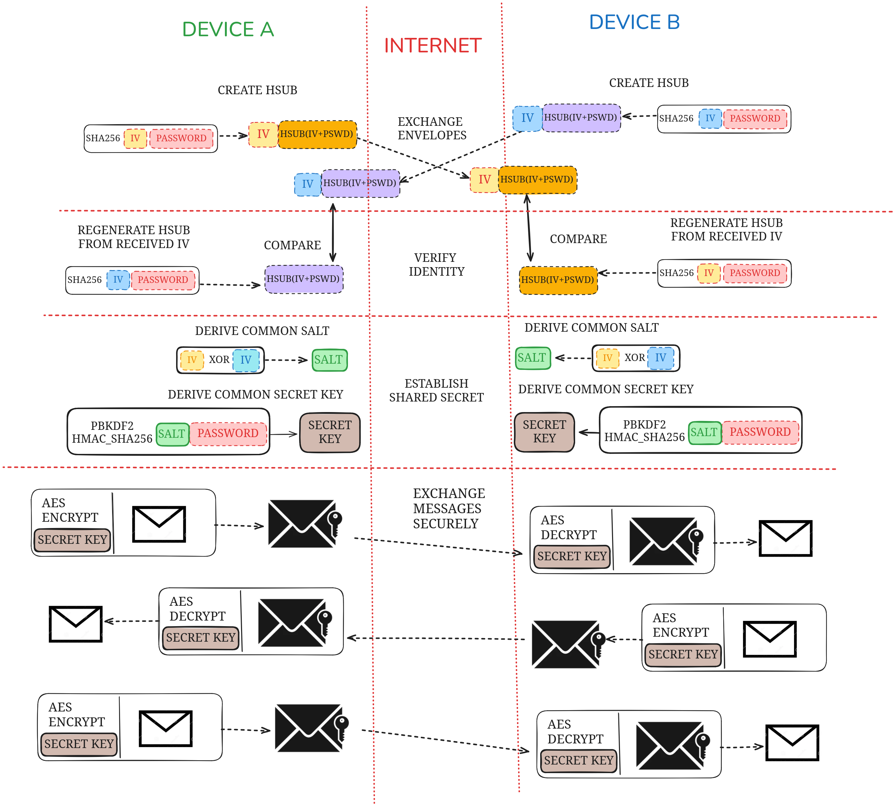

# Encryption

HiveMind secures communication between devices with modern cryptographic techniques. This page describes how messages are encrypted in transit, the structure of encrypted messages, and how HiveMind generates encryption keys.

- **End-to-end encryption**: HiveMind encrypts messages on the sender's device and decrypts them only on the receiver's device, so contents stay confidential.
- **Mutual authentication**: the identity verification step confirms both devices share the same credentials and trust each other.
- **Resistance to replay attacks**: a unique IV for each message stops an attacker from reusing a captured message.
- **Strong key derivation**: PBKDF2 and a shared salt protect against brute-force and dictionary attacks.

---

## Terminology

Before the details, here are key terms used in this page:

- **Plaintext**: unencrypted data, the original readable content before encryption.
- **Ciphertext**: encrypted data, unreadable without the decryption key.
- **[AES](https://en.wikipedia.org/wiki/Advanced_Encryption_Standard)**: Advanced Encryption Standard, a symmetric encryption algorithm.
- **[GCM](https://en.wikipedia.org/wiki/Galois/Counter_Mode)**: Galois/Counter Mode, a mode of operation for AES that provides both encryption and message authentication.
- **[IV](https://en.wikipedia.org/wiki/Initialization_vector)**: initialization vector, sometimes called `nonce`, a unique value used to initialize encryption and ensure message uniqueness.
- **[MAC](https://en.wikipedia.org/wiki/Message_authentication_code)**: Message Authentication Code, sometimes called `tag` or Integrity Check Value (`ICV`), used to verify the authenticity and integrity of a message.
- **[Salt](https://en.wikipedia.org/wiki/Salt_(cryptography))**: a random value used during key derivation to ensure unique, secure key generation, even with repeated passwords.
- **[SHA-2](https://en.wikipedia.org/wiki/SHA-2)**: a family of cryptographic hash functions, used to generate hash values (SHA-256 is used in HiveMind).
- **[PBKDF2](https://en.wikipedia.org/wiki/PBKDF2)**: Password-Based Key Derivation Function 2, a cryptographic function that strengthens passwords by hashing them multiple times to derive secure keys.

---

## Overview

HiveMind uses AES-GCM (Advanced Encryption Standard in Galois/Counter Mode) for authenticated encryption of messages in transit. This method provides both confidentiality, protecting the message content, and integrity, ensuring messages were not tampered with during transmission.

To exchange messages securely, HiveMind uses a key derivation and exchange mechanism that avoids sharing sensitive credentials directly, and ensures secure key generation and agreement between devices.

---

## Encryption in transit

When two devices communicate over HiveMind, all messages are encrypted before they go over the network. This stops eavesdropping and keeps intercepted messages unreadable without the right key.

Each encrypted message contains these components:
```json
{
  "ciphertext": "<encrypted_message>",
  "tag": "<authentication_tag>",
  "nonce": "<initialization_vector>"
}
```

- **Ciphertext**: the encrypted form of the original plaintext message.
- **Tag**: a message authentication code (MAC) that ensures the integrity and authenticity of the message.
- **Nonce (IV)**: a unique initialization vector used for encryption. It ensures each message is encrypted uniquely, even if the same key and plaintext are reused.

The `nonce` and `tag` travel with the message unencrypted, while the `ciphertext` stays confidential. This lets the receiving device verify and decrypt the message.

---

## Key generation and exchange

To encrypt and decrypt messages securely, HiveMind uses a shared secret key. This key is never transmitted directly. Instead, each device derives it independently through these steps.



> Protocol v0 starts directly with the pre-shared key. Protocol v1 still supports this by simply ignoring the handshake the server initiates.

### 1. Handshake and identity verification

- Each device generates a hash-based subkey (HSUB) using:
  - a randomly generated initialization vector (IV).
  - the user's password, or a pre-shared secret.
  - a cryptographic hash function, such as SHA-256.
- Devices exchange their `HSUB` and `IV` values over the network.
- On receiving the other side's `HSUB`, each device regenerates it locally with the received `IV` and its own password. If the computed and received `HSUB` match, the devices verify each other's identity.

### 2. Deriving a common salt

A shared salt is generated by XORing the `IV` values exchanged during the handshake:
```text
Salt = IV_A ⊕ IV_B
```
This salt gives each session a unique basis for key derivation.

### 3. Key derivation

- Both devices derive a common secret key from:
  - the salt from the previous step.
  - the user's password.
- Key derivation uses PBKDF2 (Password-Based Key Derivation Function 2) with HMAC-SHA256, to produce a cryptographically strong key.

This lets both devices independently derive the same encryption key without transmitting it over the network.

---

## Secure message exchange

Once the secret key is derived, HiveMind uses it to encrypt and decrypt all messages exchanged between devices:

1. **Encryption**:
    - The sending device encrypts the plaintext message with the secret key, using AES-GCM.
    - It packages the resulting ciphertext, along with the `nonce` and `tag`, into a message and sends it over the network.

2. **Decryption**:
    - The receiving device extracts the `ciphertext`, `nonce`, and `tag` from the message.
    - It decrypts the `ciphertext` with the same secret key, and verifies message integrity with the `tag`.

---
[← Handshake](12_handshake.md) · [Home](index.md) · [Libraries →](11_devs.md)
