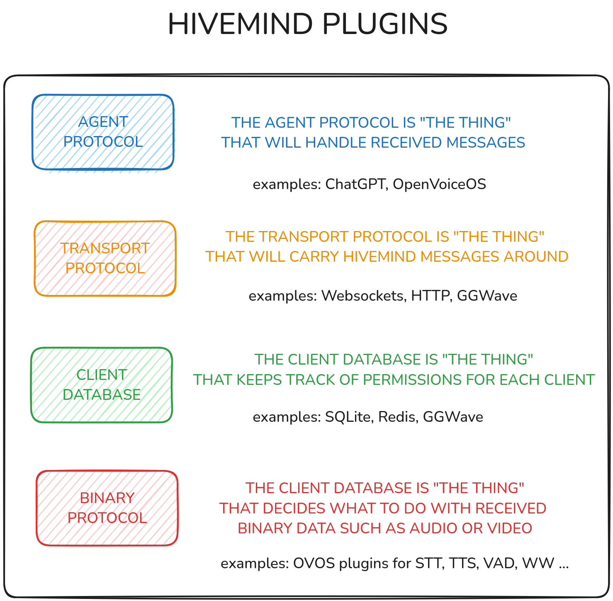

# Plugin Architecture

HiveMind Core is assembled from four categories of plugins, managed by the **HiveMind Plugin Manager** (HPM). Each category is independently swappable without touching the others.



## Plugin categories

### Network protocol plugins

Control how HiveMind listens for and connects to satellites.

| Plugin | Transport | Default port |
|---|---|---|
| `hivemind-websocket-plugin` | WebSocket (ws:// / wss://) | 5678 |
| `hivemind-http-plugin` | HTTP (polling) | 5679 |

Both WebSocket and HTTP plugins are enabled by default in `server.json`. MQTT (`hivemind-mqtt-protocol`) and Usenet/NNTP (`hivemind-usenet`) transports are planned/experimental and not confirmed published.

### Agent protocol plugins

Control which AI back-end handles incoming messages.

| Plugin | Back-end |
|---|---|
| `hivemind-ovos-agent-plugin` | OpenVoiceOS (default) |
| `hivemind-persona-agent-plugin` | ovos-persona / LLM solvers |

### Binary data handler plugins

Control how binary payloads (audio, images, files) are processed on the hub.

| Plugin | Function |
|---|---|
| `hivemind-audio-binary-protocol-plugin` | Server-side wakeword, STT, VAD, TTS for mic-satellite and voice-relay |

No binary plugin is loaded by default. Install and configure one when you need server-side audio processing.

### Database plugins

Control where client credentials are stored.

| Plugin | Backend |
|---|---|
| `hivemind-sqlite-db-plugin` | SQLite (default for new installs) |
| `hivemind-json-db-plugin` | JSON file |
| `hivemind-redis-db-plugin` | Redis (from the `hivemind-redis-database` package) |

## Configuration

Plugins are wired up in `~/.config/hivemind-core/server.json`. The default configuration:

```json
{
  "agent_protocol": {
    "module": "hivemind-ovos-agent-plugin",
    "hivemind-ovos-agent-plugin": {
      "host": "127.0.0.1",
      "port": 8181
    }
  },
  "binary_protocol": {
    "module": null
  },
  "network_protocol": {
    "hivemind-websocket-plugin": {
      "host": "0.0.0.0",
      "port": 5678
    },
    "hivemind-http-plugin": {
      "host": "0.0.0.0",
      "port": 5679
    }
  },
  "policy": {
    "chain": [
      {"module": "hivemind-ovos-agent-policy"}
    ]
  },
  "database": {
    "module": "hivemind-sqlite-db-plugin",
    "hivemind-sqlite-db-plugin": {
      "name": "clients",
      "subfolder": "hivemind-core"
    }
  }
}
```

## Installing plugins

Plugins are installed as Python packages via pip:

```bash
pip install hivemind-audio-binary-protocol
pip install hivemind-redis-database
```

After installation, update `server.json` to reference the new plugin (entry-point) name — note that the installed package name may differ from the plugin name used in config (e.g. the `hivemind-redis-database` package provides the `hivemind-redis-db-plugin` plugin, and `hivemind-audio-binary-protocol` provides `hivemind-audio-binary-protocol-plugin`).

## Developing plugins

Use the `hivemind-plugin-manager` package to discover and instantiate plugins programmatically:

```python
from hivemind_plugin_manager import find_plugins, HiveMindPluginTypes

# Discover all installed database plugins
print(find_plugins(HiveMindPluginTypes.DATABASE))

# Discover all installed agent protocol plugins
print(find_plugins(HiveMindPluginTypes.AGENT_PROTOCOL))
```

Factory classes handle instantiation:

```python
from hivemind_plugin_manager import DatabaseFactory, AgentProtocolFactory

db = DatabaseFactory.create("hivemind-redis-db-plugin",
                            password="secret", host="localhost", port=6379)

agent = AgentProtocolFactory.create("hivemind-ovos-agent-plugin")
```
